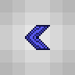

# Документация TUI

Библиотека предоставляет пользователю возможность создавать области блоков на карте,
которые работают по принципу обычного пользовательского интерфейса: на эту область можно нажимать
с помощью The Grand Design (Великий План) и что-то может происходить. НаExample, можно поставить
кнопку, которая по нажатию будет выводить заданный текст в чат. И в принципе разработчик ограничен
лишь своей фантазией в том, что можно создать на пользовательском интерфейсе.
Exampleом может быть настольная игра сапер, на которую ушло 314 строк кода (включая логику самой игры):


***

## Содержание

* [Основы интерфейса](#Основы-интерфейса)
* [Базовые операции VisualObject](#Базовые-операции-VisualObject)
* [4 независимых способа автоматического регулирования позиций и размеров объектов](#4-независимых-способа-автоматического-регулирования-позиций-и-размеров-объектов)
* [Layout](#Layout)
* [Grid](#Grid)
* [Alignment](#Alignment)
* [FullSize](#FullSize)
* [Как происходит нажатие](#Как-происходит-нажатие)
* [Класс UIConfiguration](#Класс-UIConfiguration)
* [Класс UIStyle](#UIStyle-class)
* [Сигналы PulseType](#Сигналы-PulseType)
* [Загрузка и отгрузка виджетов](#Загрузка-и-отгрузка-виджетов)
* [База данных](#База-данных)
* [Создание собственного виджета](#Создание-собственного-виджета)
* [Общие факты о клиентской стороне управления интерфейсом](#Общие-факты-о-клиентской-стороне-управления-интерфейсом)
* [Виджеты](#Виджеты)

***

## Основы интерфейса

Каждый элемент, будь то кнопка, надпись, поле ввода, слайдер или что-то еще, является объектом,
наследующемся от базового класса VisualObject. НаExample, слайдер - это класс Slider, наследующийся сразу
от VisualObject. А кнопка - это класс Button, наследующийся от класса Label, который, в свою очередь,
наследуется от VisualObject. Любой виджет, работающий в этой библиотеке, обязан наследоваться от VisualObject.
Далее такие кнопки и слайдеры будут называться "виджетами".

Весь интерфейс представляет из себя набор деревьев, каждая вершина которого - VisualObject
или объект класса, наследующегося от VisualObject (виджет). Таким образом, игра сапер представляет
из себя одно из таких деревьев. При этом корень дерева - это всегда объект класса RootVisualObject
или класса, наследующегося от RootVisualObject (наExample, Panel). Для разработчика приложений
на интерфейсе объект класса RootVisualObject не сильно отличается от обычного VisualObject,
потому как RootVisualObject наследуется от VisualObject и лишь добавляет некоторые поля и
функционал (наExample, функции всплывающего окна ShowPopUp, Alert, Confirm).


Дочерние элементы объекта VisualObject находятся в закрытом поле Child (List<VisualObject>).
Обычно не требуется обращение к этому списку напрямую, но в целях отладки это возможно: GetChild(int index).
Родительская вершина хранится в поле Parent (VisualObject).
Корень дерева доступен по свойству Root (RootVisualObject). Учтите, что получить доступ к этому полю
можно только после того, как будет вызван хотя бы один Update всего дерева. Чтобы получить корень дерева
до вызова Update(), воспользуйтесь методом GetRoot(). Все корни интерфейса автоматически обновляются
и загружаются после инициализации игры (на хуке GamePostInitialize), таким образом в вашем плагине вам достаточно создать свой интерфейс и добавить его в TUI.

Добавить дочерний элемент можно несколькими способами, наExample, вызвав функцию Add:
```cs
VisualObject Add(VisualObject newChild, int? layer);
```

***

## Базовые операции VisualObject

Есть несколько важных операций, которые можно применять к объектам VisualObject:
1. **Update()**
	* Рекурсивная функция, обновляющая каждый из объектов поддерева (устанавливает нужные значения в
	нужные поля, рассчитывает позицию относительных элементов, ...).
2. **Apply()**
	* Рекурсивная функция, отрисовывающая объект на карте (изменение блоков карты в соответствии
	со стилем отображения элемента).
3. **Draw()**
	* Отправка отрисованного (хотя не обязательно) объекта игрокам с помощью SendSection или SendTileSquare.
4. **Pulse(PulseType)**
	* Отправка указанного сигнала дереву объектов.

Первые три операции зачастую идут в указанном порядке:
```cs
VisualObject node = ...
node.Update().Apply().Draw();
```
Что логично, ведь для отправки нарисованного в Draw() необходимо сперва отрисовать в Apply(),
а для отрисовки в Apply() очень часто необходимо сперва обновить виджет в Update().

Каждый по отдельности из перечисленных выше методов (за исключением Draw) работают в следующей последовательности:
1. Применить операцию к своему объекту.
2. Применить операцию к дочерним объектам.
[3.] Применить другие операции к своему объекту.

#### Так, у Update следующая последовательность обновлений (происходят при вызове Update()):
1. Обновить поля/свойства своей вершины в UpdateThis().
2. Обновить размеры и затем позиции дочерних объектов в UpdateChildPositioning().
3. Рекурсивно запустить Update() у дочерних объектов.
4. Обновить поля/свойства своей вершины, зависящие от обновления дочерних объектов в PostUpdateThis().

НаExample, вызов Update() у виджета VisualContainer делает приблизительно следующее:
Вычисляет некоторые свои поля (Root, ProviderX, ProviderY, ...), потом вычисляет размеры и позиции
дочерних элементов, находящихся в решетке/сетке/отступе и рекурсивно запускает вызов Update() у дочерних элементов.

#### Последовательность действий при Apply():
1. Отрисовать (изменить блоки) своей вершины в ApplyThis().
2. Рекурсивно запустить Apply() у дочерних объектов в ApplyChild().

НаExample, вызов Apply() у виджета AlertWindow устанавливает во всей области объекта 165 стену (Sapphire
Gemspark Wall) с краской 27 (серая), затем рекурсивно вызывает Apply() у дочерних элементов.

#### Последовательность действий при Pulse(PulseType):
1. Обработать сигнал у своей вершины в PulseThis(PulseType).
2. Рекурсивно передать сигнал дочерним объектам в PulseChild(PulseType).

НаExample, вызов Pulse(PulseType.Reset) у виджета Slider сбрасывает введенное значение на Input.DefaultValue,
затем рекурсивно вызывает Pulse(PulseType.Reset) у дочерних элементов.

Вызов Draw отправляет секцию или SendTileSquare размером с объект всем игрокам, находящимся рядом с интерфейсом.

***

## Класс TUI

Существует статичный класс TUI, который представляет из себя список корней RootVisualObject
и обладает операциями, похожими на описанные выше для VisualObject:
Update, Apply, Draw
Эти функции делают одноименный вызов для всех корней. Таким образом, чтобы полностью обновить
и отрисовать все деревья пользовательского интерфейса, необходимо выполнить:
```cs
TUI.Update();
TUI.Apply();
TUI.Draw();
```

Чтобы создать новый интерфейс, необходимо вызвать метод Create класса TUI:
```cs
RootVisualObject Create(RootVisualObject root);
```

Этот метод создает объект RootVisualObject, (который, в свою очередь, наследуется от
VisualObject), затем добавляет его в список корней TUI.
Таким образом, теперь система при обработке нажатий *увидит* этот объект и проверит, не на него ли нажал игрок.

Все элементы этого интерфейса теперь необходимо добавлять уже к этой панели, вот Example создания
панели и добавления нескольких виджетов на нее:
```cs
// Определяем позицию (по умолчанию) и размеры интерфейса.
int x = 100, y = 100, w = 50, h = 40;
// Передаем в панель пустой провайдер (интерфейс будет рисоваться на Main.tile).
object provider = null;
// Хотя можем использовать в качестве провайдера, наExample, FakeTileRectangle из FakeManager:
//object provider = FakeManager.FakeManager.Common.Add("TestPanelProvider", x, y, w, h);

// Создаем панель со стеной Diamond gemspark wall с черной краской.
Panel root = TUI.TUI.Create(new Panel("TestPanel", x, y, w, h, null,
	new ContainerStyle() { Wall = WallID.DiamondGemspark, WallColor = PaintID.Black }, provider)) as Panel;
// Создаем виджет Label (отображение текста) с белыми символами.
Label label1 = new Label(1, 1, 17, 2, "some text", new LabelStyle() { TextColor = PaintID.White });
// Добавляем к панели
root.Add(label1);

// Создаем контейнер, занимающий нижнюю (большую) половину нашей панели, закрашенный белой краской.
// Функция Add возвращает только что добавленный объект в типе VisualObject,
// так что добавление элемента можно реализовать следующим образом:
VisualContainer node = root.Add(
	new VisualContainer(0, 15, w, 25, null, new ContainerStyle() { WallColor = PaintID.White })
) as VisualContainer;
// В этот контейнер добавим кнопку, которая по нажатию будет отправлять нажавшему текст в чат.
node.Add(new Button(5, 0, 12, 4, "lol", null, new ButtonStyle()
	{ Wall=165, WallColor = PaintID.DeepGreen }, (self, touch) =>
		touch.Player().SendInfoMessage("You pressed lol button!")));
```


***

## 4 независимых способа автоматического регулирования позиций и размеров объектов

#### Позиционирование дочерних объектов внутри текущей вершины:
* **[Layout](#Layout)** (разметка)
* **[Grid](#Grid)** (решетка)

#### Позиционирование текущей вершины внутри родительской:
* **[Alignment](#Alignment)** (отступ)

#### Регулирование размеров объекта относительно родителя:
* **[FullSize](#FullSize)** (полноразмерность)

***

## Layout

Метод SetupLayout позволяет автоматически располагать детей, добавленных с помощью метода AddToLayout,
в определенном порядке друг за другом в указанном направлении:

```cs
VisualObject SetupLayout(Alignment alignment, Direction direction, Side side, ExternalOffset offset, int childIndent, bool boundsIsOffset);
```
<details><summary> <sup><b><ins>Parameters</ins></b> (click here to expand)</sup> </summary>
<p>

* Alignment **alignment**
	* Сторона/угол/центр, где будут располагаться объекты layout. НаExample, правый верхний угол - Alignment.TopRight.
* Direction **direction**
	* Направление, по которому будут добавляться объекты. НаExample, вниз - Direction.Down.
* Side **side**
	* Сторона, к которой будут прилегать объекты. НаExample, по центру - Side.Center.
* ExternalOffset **offset**
	* Отступ layout. НаExample, отступ сверху на 3 и слева на 2: new ExternalOffset() { Up=3, Left=2 }
* int **childIndent**
	* Расстояние между объектами в layout.
* bool **boundsIsOffset**
	* Если установлено true, то блоки объектов, выходящие за границы layout, не будут рисоваться.

</p>
</details>

Example:
```cs
// Настраиваем конфигурацию layout.
node.SetupLayout(Alignment.Center, Direction.Right, Side.Center, null, 3, false);
// Добавляем в layout виджет InputLabel, позволяющий вводить текст.
node.AddToLayout(new InputLabel(0, 0, new InputLabelStyle()
	{ TextColor = PaintID.Black, Type = InputLabelType.All, TextUnderline = LabelUnderline.None },
	new Input<string>("000", "000")));
// Добавляем в layout еще один виджет ItemRack, который соответствует Weapon rack: отображение предмета
// на стойке размером 3х3. По нажатию выводит относительные и абсолютные координаты этого нажатия.
node.AddToLayout(new ItemRack(0, 0, new ItemRackStyle() { Type = 200, Left = true }, (self, touch) =>
	Console.WriteLine($"Touch: {touch.X}, {touch.Y}; absolute: {touch.AbsoluteX}, {touch.AbsoluteY}")));
ItemRack irack1 = node.AddToLayout(new ItemRack(0, 0,
	new ItemRackStyle() { Type = 201, Left = true })) as ItemRack;
// ItemRack позволяет сверху добавть текст с помощью таблички:
irack1.SetText("lololo\nkekeke");
// Наконец, добавляем слайдер в layout.
node.AddToLayout(new Slider(0, 0, 10, 2, new SliderStyle() {
	Wall = WallID.AmberGemsparkOff, WallColor = PaintID.White }));
```


***

## Grid

Метод SetupGrid позволяет представить объект в виде решетки с абсолютными или относительными размерами колонок и линий:
```cs
VisualObject SetupGrid(IEnumerable<ISize> columns, IEnumerable<ISize> lines, Offset offset, bool fillWithEmptyObjects);
```
<details><summary> <sup><b><ins>Parameters</ins></b> (click here to expand)</sup> </summary>
<p>

* IEnumerable\<ISize\> **columns**
	* Размеры колонок. НаExample, левая колонка размером 10 блоков, а правая - все оставшееся место: new ISize[] { Absolute(10), Relative(100) }
* IEnumerable\<ISize\> **lines**
	* Размеры линий. НаExample, центральная линия занимает 20 блоков, а верхняя и нижняя поровну делят оставшееся место: new ISize[] { Relative(50), Absolute(20), Relative(50) }
* Offset **offset**
	* Отступ сетки, включая внутренние отступы ячеек между собой и внешние отступы от границы объекта.
* bool **fillWithEmptyObjects**
	* Заполнить ли автоматически все ячейки пустыми VisualContainer или нет.

</p>
</details>

Example:
```cs
// Настраиваем конфигуарцию сетки grid. Указываем, что нужно все ячейки заполнить автоматически.
// Две колонки (правая размером 15, левая - все остальное) и две линии, занимающие одинаковое количество места.
node.SetupGrid(
	new ISize[] { new Relative(100), new Absolute(15) }, // Размеры колонок
	new ISize[] { new Relative(50), new Relative(50) }, // Размеры линий
	null, true);
// В левой верхней ячейке (на пересечении первой колонки и первой линии) установим оранжевый цвет фона.
node[0, 0].Style.WallColor = PaintID.DeepOrange;
// В правой верхней поставим сапфировую (синюю) стену без краски.
node[1, 0].Style.Wall = WallID.SapphireGemspark;
node[1, 0].Style.WallColor = PaintID.None;
// В левой нижней ячейке можно расположить виджет Label с блоком SandStoneSlab.
// Несмотря на то, что координаты и размеры указаны как 0, они автоматически будут
// установлены, так как объект находится в решетке Grid.
node[0, 1] = new Label(0, 0, 0, 0, "testing", null, new LabelStyle()
{
	Tile = TileID.SandStoneSlab,
	TileColor = PaintID.Red,
	TextColor = PaintID.Black
});
```


Для тестов вы можете вызвать функцию ShowGrid(), чтобы увидеть решетку даже без объектов:
```cs
// Устанавливаем большую и сложную решетку.
node.SetupGrid(new ISize[] { new Absolute(3), new Relative(50), new Absolute(6), new Relative(50) },
	new ISize[] { new Relative(20), new Absolute(5), new Relative(80) });
// Хоть мы и установили решетку у node, мы все еще можем добавлять объекты по-старому.
// Добавим кнопку, которая по нажатию отрисовывает сетку, а по отпусканию скрывает ее.
node.Add(new Button(3, 3, 10, 4, "show", null, new ButtonStyle()
{
	WallColor = PaintID.DeepBlue,
	BlinkStyle = ButtonBlinkStyle.Full,
	TriggerStyle = ButtonTriggerStyle.Both
}, (self, touch) =>
{
	if (touch.State == TouchState.Begin)
		node.ShowGrid();
	else
		node.Apply().Draw();
}));
```


***

## Alignment

Метод SetAlignmentInParent позволяет автоматически располагать объект в относительной позиции в родителе:

```cs
VisualObject SetAlignmentInParent(Alignment alignment, ExternalOffset offset, bool boundsIsOffset);
```
<details><summary> <sup><b><ins>Parameters</ins></b> (click here to expand)</sup> </summary>
<p>

* Alignment **alignment**
	* Место расположения объекта в родителе.
* ExternalOffset **offset**
	* Отступы от границ родителя.
* bool **boundsIsOffset**
	* Рисовать ли тайлы, которые вылезают за границы offset.

</p>
</details>

Example (метод Add возвращает только что добавленный дочерний объект):
```cs
// Добавляем label и сразу устанавливаем Alignment.DownRight с отступом 3 блока справа и 1 снизу.
node.Add(new Label(0, 0, 16, 6, "test", new LabelStyle() { WallColor = PaintID.DeepPink }))
	.SetAlignmentInParent(Alignment.DownRight, new ExternalOffset() { Right = 3, Down = 1 });
```


***

## FullSize

Метод SetFullSize позволяет автоматически устанавливать размеры объекта (как по ширине, так и по высоте)
относительно размеров родителя (расширять в точности до размеров родительского объекта):
```cs
VisualObject SetFullSize(bool horizontal, bool vertical);
```
<details><summary> <sup><b><ins>Parameters</ins></b> (click here to expand)</sup> </summary>
<p>

* bool **horizontal**
	* Устанавливать ширину объекта равной ширине родителя.
* bool **vertical**
	* Устанавливать высоту объекта равной высоте родителя.

</p>
</details>

Или:
```cs
VisualObject SetFullSize(FullSize fullSize);
```
<details><summary> <sup><b><ins>Parameters</ins></b> (click here to expand)</sup> </summary>
<p>

* FullSize **fullSize**
	* Одно из значений: FullSize.None, FullSize.Horizontal, FullSize.Vertical, FullSize.Both.

</p>
</details>

Example:
```cs
// Сделаем наш контейнер node размером с корневой root по ширине.
node.SetFullSize(true, false);
```


***

## Как происходит нажатие

На каждый элемент интерфейса (являющегося объектом класса VisualObject) можно нажать
с помощью предмета The Grand Design (Великий План). Каждому нажатию соответствует
объект нажатия Touch, содержащий всю необходимую информацию о нем.

### Класс Touch
<details><summary> <b><ins>Properties</ins></b> (click here to expand) </summary>
<p>

* int **X**
	* Координата по горизонтали относительно левой границы объекта.
* int **Y**
	* Координата по вертикали относительно верхней границы объекта.
* int **AbsoluteX**
	* Координата по горизонтали относительно левой границы мира.
* int **AbsoluteY**
	* Координата по вертикали относительно верхней границы мира.
* TouchState **State**
	* Состояние нажатия. Принимает одно из значений: Begin, Moving, End.
* UserSession **Session**
	* Объект сессии нажимающего пользователя.
* VisualObject **Object**
	* Объект, на который это нажатие попало.
* int **Index**
	* Индекс нажатия, считая от начала нажатия (TouchState.Begin).
* int **TouchSessionIndex**
	* Индекс промежутка нажатия, в который этот Touch был совершен.
* bool **Undo**
	* true у нажатия с TouchState.End, если игрок окончил нажатие
	правой кнопкой мыши (отмена действия плана).
* byte **Prefix**
	* Префикс плана (The Grand Design).
* bool **Red**, **Green**, **Blue**, **Yellow**, **Actuator**, **Cutter**
	* Включен ли красный/зеленый/желтый провод/активатор/кусачки. Актуально только
	на момент TouchState.End.
* DateTime **Time**
	* Время нажатия по UTC.

</p>
</details>

Промежутком нажатия считается промежуток времени от нажатия левой кнопки мыши
(создания проджектайла плана) до отпускания левой кнопки мыши или отмены
правой кнопкой мыши.

Каждому нажатию Touch этого промежутка соответствует состояние нажатия State.
* TouchState.Begin
	* При нажатии левой кнопки мыши.
* TouchState.Moving
	* При движении планом с зажатой кнопкой мыши.
* TouchState.End
	* При отпускании левой кнопки мыши или при отмене действия правой кнопкой мыши.

Каждому игроку соответствует объект UserSession (сессия игрока), который хранит
некоторые общие данные о нём.

### Класс UserSession
<details><summary> <b><ins>Properties</ins></b> (click here to expand) </summary>
<p>

* bool **Enabled**
	* Если установить значение false, то все нажатия вплоть до следующего TouchState.End
	будут проигнорированы. Затем игрок снова сможет нажимать.
* int **PlayerIndex**
	* Индекс пользователя, соответствующего этому объекту UserSession.
* int **TouchSessionIndex**
	* Текущий индекс промежутка нажатия. Увеличивается на 1 с каждым TouchState.End.
* int **ProjectileID**
	* ID проджектайла Великого Плана, соответствующего этому нажатию.
* Touch **PreviousTouch**
	* Объект предыдущего нажатия.
* Touch **BeginTouch**
	* Объект первого нажатия промежутка (TouchState.Begin).
* VisualObject **Acquired**
	* Привязанный к промежутку нажатия объект. Однажды привязав с помощью
	Configuration.SessionAcquire какой-либо VisualObject к промежутку нажатия, все
	последующие нажатия будут проходить только к этому объекту вплоть до окончания
	нажатия (TouchState.End).
* ConcurrentDictionary<object, object> **Data**
	* Приватное runtime-хранилище данных, к которому можно обратиться через оператор[object key].

</p>
</details>

При нажатии, если этот объект удовлетворяет условиям (cм. [UIConfiguration](#Класс-UIConfiguration)),
вызывается метод VisualObject.Invoke(Touch touch) с передающимся объектом нажатия Touch.
Метод Invoke по умолчанию вызывает функцию-колбэк, хранящуюся в поле VisualObject.Callback.
Это пользовательская функция, в которой программист указывает, что он хочет, чтобы происходило
по нажатию на этот объект. Виджеты, написанные на C#, могут не использовать эту функцию,
а напрямую переопределить Invoke.

***

## Класс UIConfiguration

Каждый объект VisualObject имеет настройки нажатия и отрисовки, хранящиеся в свойстве
Configuration класса UIConfiguration.
<details><summary> <b><ins>Properties</ins></b> (click here to expand) </summary>
<p>

* bool **UseBegin**
	* Allows to touch this node if touch.State == TouchState.Begin. True by default.
* bool **UseMoving**
	* Allows to touch this node if touch.State == TouchState.Moving. False by default.
* bool **UseEnd**
	* Allows to touch this node if touch.State == TouchState.End. False by default.
* bool **SessionAcquire**
	* Once node is touched all future touches within the same session will pass to this node.
* bool **BeginRequire**
	* Allows to touch this node only if current session began with touching it.
* bool **UseOutsideTouches**
	* Only for nodes with SessionAcquire. Passes touches even if they are not inside of this object.
* bool **Ordered**
	* Touching child node would place it on top of Child array layer so that it would be drawn
	above other objects with the same layer and check for touching first.
* object **Permission**
	* Object that should be used for checking if user can touch this node (permission string for TShock).
* Lock **Lock**
	* Touching this node would prevent touches on it or on the whole root for some time.
* CustomCallbacks **Custom**
	* Collection of custom callbacks.

</p>
</details>

***

## Класс UIStyle

Каждый объект VisualObject имеет стили отрисовки, хранящиеся в свойстве Style класса UIStyle.
Каждое из свойств UIStyle является Nullable, значение null означает, что нужно оставить
этот параметр тайла как есть (с помощью этого реализуется прозрачность).
<details><summary> <b><ins>Properties</ins></b> (click here to expand) </summary>
<p>

* bool? **Active**
	* Sets tile.active(Style.Active) for every tile.
	If not specified sets to true in case Style.Tile is specified,
	otherwise to false in case Style.Wall is specified.
* ushort? **Tile**
	* Sets tile.type = Style.Tile for every tile.
* byte? **TileColor**
	* Sets tile.color(Style.TileColor) for every tile.
* byte? **Wall**
	* Sets tile.wall = Style.Wall for every tile.
* byte? **WallColor**
	* Sets tile.wallColor(Style.WallColor) for every tile.
* bool? **InActive**
	* Sets tile.inActive(Style.InActive) for every tile.

</p>
</details>

***

## Сигналы PulseType

С помощью функций Pulse(PulseType), PulseThis(PulseType) и PulseChild(PulseType)
можно распространять сигналы в дереве объектов интерфейса следующих типов:
* Reset
	* Сигнал сбрасывания объекта. В виджетах ввода данных устанавливает изначальные значения и т.д.
* PositionChanged
	* Сигнал посылается автоматически поддереву, если корень этого поддерева изменил свою позицию
	или размеры.
* User1
	* Пользовательский сигнал
* User2
* User3

***

## Загрузка и отгрузка виджетов

Некоторым виджетам необходимо загружать ресурсы при создании и освобождать их при удалении.
В библиотеке есть средство для работы с подобными ресурсами:
У любого виджета есть переопределяемые методы LoadThisNative() и DisposeThisNative(),
которые вызываются автоматически во время загрузки и освобождения ресурсов соответственно.
Загрузка Load() происходит единожды и автоматически при добавлении виджета в основное дерево интерфейса.
При этом гарантируется, что загрузка произойдет после инициализации игры (события GamePostInitialize).
Отгрузка Dispose() происходит единожды и автоматически при отгрузке плагина интерфейса TUI и при
удалении объекта с помощью Remove() (таким образом, единожды удаленные объекты невозможно
снова использовать). При этом гарантируется, что отгрузка не произойдет, если не была
произведена загрузка.
```cs
virtual void LoadThisNative();
virtual void DisposeThisNative();
```

***

## База данных

У каждого объекта VisualObject есть свойство Name и FullName.
Name обязательно задается при создании RootVisualObject/Panel, для остальных объектов это
свойство не обязательно.

FullName - полное название в дереве интерфейса.
НаExample:
1. Создаем панель Panel с именем "TestPanel" и добавляем к ней контейнер VisualContainer.
2. К этому контейнеру добавим слайдер Slider.
3. Свойство FullName этого слайдера будет выдавать значение
"TestPanel[0].VisualContainer[0].Slider", где 0 - индекс в массиве дочерних элементов.
4. У контейнера установим свойству Name значение "lol".
5. То же самое свойство FullName слайдера теперь будет выдавать "TestPanel.lol[0].Slider".
6. У слайдера установим свойству Name значение "kek".
7. Свойство FullName слайдера теперь будет выдавать "TestPanel.lol.kek".

Поле FullName является ключом, по которому хранятся данные объекта в базе данных в
таблице формата ключ-значение. Потому, если вы хотите хранить у какого-то объекта VisualObject
данные в базе данных, рекомендуется у него и всех его родителей установить уникальное свойство Name,
чтобы изменение индекса в массиве не поменяло ключ и, соответственно, данные.

Прочитать данные из базы данных можно с помощью метода DBRead:
```cs
bool DBRead();
```
Записать данные в базу данных можно с помощью метода DBWrite:
```cs
void DBWrite();
```
Эти методы по умолчанию пытаются вызывать функции Configuration.Custom.DBRead и Configuration.Custom.DBWrite соответственно.

Данные записываются и читаются в потоковом формате. Для определения поведения считывания
и записи потока данных существуют переопределяемые функции чтения BinaryReader и записи
в BinaryWriter:
```cs
virtual void DBReadNative(BinaryReader br);
virtual void DBWriteNative(BinaryWriter bw);
```

НаExample, виджет панели Panel переопределяет эти методы для того, чтобы запомнить позицию и размеры:
```cs
protected override void DBReadNative(BinaryReader br)
{
	int x = br.ReadInt32();
	int y = br.ReadInt32();
	int width = br.ReadInt32();
	int height = br.ReadInt32();
	SetXYWH(x, y, width, height);
}

protected override void DBWriteNative(BinaryWriter bw)
{
	bw.Write((int)X);
	bw.Write((int)Y);
	bw.Write((int)Width);
	bw.Write((int)Height);
}
```

Вышеописанное актуально для хранения данных, относящихся к объекту в целом, но не к конкретному
пользователю. Для хранения данных, относящихся к этому объекту и пользователю в совокупности
есть аналогичные методы с указанием идентификатора пользователя:
```cs
bool UDBRead(int user);
void UDBWrite(int user);
virtual void UDBReadNative(BinaryReader br, int user);
virtual void UDBWriteNative(BinaryWriter bw, int user);
```

***

## Команда tuipanel

Плагин добавляет команду ```/tuipanel <panel name> [<x> <y>] [<width> <height>]```.
В качестве параметра <panel name> нужно указать название корневого объекта интерфейса (RootVisualObject).
Виджет панели Panel тоже является корневым объектом (так как наследуется от RootVisualObject).
Вызывав команду ```/tuipanel "your panel"```, вы узнаете координаты и размеры панели "your panel".
Чтобы сменить позицию, вы можете написать: ```/tuipanel "panel" 150 100``` - тогда панель "panel" переместится в координаты (150, 100).
Можно сменить и размеры: ```/tuipanel "panel" 150 100 50 40``` - тогда панель не только переместится, но и поменяет размер на (50, 40).

***

## Создание собственного виджета

Для создания собственного виджета необходимо создать класс, наследующийся от VisualObject (или другого виджета).
Для собственного/особенного обновления (полей/данных/статистики/...) виджета можно переопределить метод UpdateThisNative.
Метод UpdateThis вызывается до вызова UpdateChild, потому, если обновление требует обновленных дочерних объектов, можно переопределить метод PostUpdateThisNative.
Аналогично, можно переопределить ApplyThisNative, чтобы добавить собственную отрисовку у виджета.

***

## Общие факты о клиентской стороне управления интерфейсом

1. Клиент работает так, что в начале нажатия планом пакеты перемещения мыши отправляются очень быстро,
	а Exampleно через секунду скорость уменьшается и становится постоянной.
2. В режимах освещения Retro и Trippy отрисовка интерфейса происходит быстрее и плавнее.
3. Нажатием правой кнопки мыши во время использования плана можно отменить нажатие. Это действие особым
	образом обрабатывается в некоторых виджетах (трактуется как отмена действия).
4. Некоторые тайлы ломаются при определенных условиях при отправке с помощью SendTileSquare (наExample, это статуя без блоков под ней).
Для того, чтобы заставить объект рисоваться с помощью отправок секций, достаточно установить его свойству ForceSection значение true.

***

# Widgets

<details><summary> <b><ins>List</ins></b> (click here to expand) </summary>
<p>

* [VisualObject](#VisualObject)
* [VisualContainer](#VisualContainer)
* [RootVisualObject](#RootVisualObject)
* [Panel](#Panel)
* [Label](#Label)
* [Button](#Button)
* [Slider](#Slider)
* [Checkbox](#Checkbox)
* [Separator](#Separator)
* [InputLabel](#InputLabel)
* [ItemRack](#ItemRack)
* [VisualSign](#VisualSign)
* [FormField](#FormField)
* [Image](#Image)
* [Video](#Video)
* [AlertWindow](#AlertWindow)
* [ConfirmWindow](#ConfirmWindow)
* [ScrollBackground](#ScrollBackground)
* [ScrollBar](#ScrollBar)
* [Arrow](#Arrow)

</p>
</details>

Most widgets have style parameter in constructor and it is often not the UIStyle object but class
that inherits from UIStyle. For example, ButtonStyle includes both UIStyle properties and different
styles associated with the blinking buttons: BlinkColor, BlinkDelay, TriggerStyle, BlinkStyle.
If the widget has a style in the constructor with its own type (like ButtonStyle at Button),
then this widget has a field with the name of the corresponding style type.
So, the Button widget has the .ButtonStyle property, which contains the value of this style.
Note that in this case, the .Style property returns the same object, but in the UIStyle type.

***

## VisualObject
[More about fields, properties and methods of VisualObject](ru_VisualObject.md)

Basic object of user interface. Every other widget inherits from this type.
As for most of other widgets parameters configuration, style and callback are not neccessarily.
Structure of VisualObject constructor sets the style of all other widget constructors:
[coordinates] -> [sizes] -> [text (no such parameter in this case)] -> [configuration] -> [style] -> [callback function].
```cs
VisualObject(int x, int y, int width, int height, UIConfiguration configuration,
	UIStyle style, Action<VisualObject, Touch> callback);
```
<details><summary> <sup><b><ins>Parameters</ins></b> (click here to expand)</sup> </summary>
<p>

* int **x**
	* *Relative* horizontal coordinate from left side of Parent (or from left border of world in case there is no Parent object).
* int **y**
	* *Relative* vertical coordinate from top side of Parent (or from top border of world in case there is no Parent object).
* int **width**
	* Object width.
* int **height**
	* Object height.
* [UIConfiguration **configuration**]
	* Object configuration (when can touch, who can touch, ...)
* [UIStyle **style**]
	* Style of drawing (walls, wall paint, tiles, tile paint, ...)
* [Action<VisualObject, Touch> **callback**]
	* Function to be called when someone touches this object. Has 2 parameters:
	VisualObject (this object) and Touch - data about touch coordinates, state, pressing player (.Session.UserIndex), ...
You can get access TSPlayer by calling touch.Player() function that is available in TUIPlugin.dll assembly.

</p>
</details>

Example:
```cs
VisualObject obj = node.Add(new VisualObject(5, 5, 8, 4, null, new UIStyle()
{
	Wall = WallID.AmethystGemspark,
	WallColor = PaintID.DeepPurple
}, (self, touch) =>
	TSPlayer.All.SendInfoMessage($"Relative: ({touch.X}, {touch.Y}); Absolute: ({touch.AbsoluteX}, {touch.AbsoluteY})")));
```


***

## VisualContainer
Container widget for holding other widgets inside. It is highly recommended to use it despite the fact
that you can use a regular VisualObject or any other widget for holiding other objects inside.
VisualContainer guarantees correct work of widgets ScrollBackground and ScrollBar inside this container.
```cs
VisualContainer(int x, int y, int width, int height, UIConfiguration configuration,
	ContainerStyle style, Action<VisualObject, Touch> callback);
VisualContainer();
VisualContainer(UIConfiguration configuration);
VisualContainer(ContainerStyle style);
```
<details><summary> <b><ins>ContainerStyle</ins></b> properties (click here to expand) </summary>
<p>

* All properties of [UIStyle](#UIStyle-class)
* bool Transparent
	* If set to false then container would inherit parent's wall and wall paint,
	also every Apply() would clear every tile before drawing.

</p>
</details>

Example:
```cs
VisualContainer node2 = node.Add(
	new VisualContainer(5, 5, 20, 10, null, new ContainerStyle() { WallColor = PaintID.Black })
) as VisualContainer;
```

***

## RootVisualObject
[More about fields, properties and methods of RootVisualObject](en_VisualObject.md#RootVisualObject--VisualObject)

Widget that must be the root of a user interface tree.
```cs
RootVisualObject(string name, int x, int y, int width, int height,
	UIConfiguration configuration, ContainerStyle style, object provider);
```
<details><summary><sup><b><ins>Parameters</ins></b> (click here to expand)</sup> </summary>
<p>

* string **name**
	* Unique name of user interface root.
* object **provider**
	* Object of tile provider (ITileProvider). By default - null (interface would be drawn on Main.Tile,
	tiles of map would be modified irrevocably).
	You can use FakeTileRectangle from [FakeManager](https://github.com/AnzhelikaO/FakeManager) as a value,
	so that interface would draw *above* the map.

</p>
</details>

***

## Panel
Variety of RootVisualObject that has some features:
Panel can be moved and can change size.
By default the panel has 2 buttons:
* Button for moving panel (drag) 1x1 in top left corner.
* Button for changin panel size (resize) 1x1 in bottom right corner.

Panel saves it's position and size automatically to database and loads it on server start.
You can save the position and size manually by calling SavePosition() method.

```cs
Panel Panel(string name, int x, int y, int width, int height,
	UIConfiguration configuration = null, UIStyle style = null, object provider = null);
Panel Panel(string name, int x, int y, int width, int height, UIConfiguration configuration,
	UIStyle style, PanelDrag drag, PanelResize resize, object provider = null);
```


***

## Label
Widget for showing text with character and digit statues.
```cs
Label(int x, int y, int width, int height, string text, LabelStyle style);
```
<details><summary><b><ins>LabelStyle</ins></b> properties (click here to expand) </summary>
<p>

* All properties of [UIStyle](#UIStyle-class)
* byte **TextColor**
* Offset **TextOffset**
* Alignment **TextAlignment**
	* Where to place the text (up right corner/down side/center/...)
* Side **TextSide**
	* Side to which shorter lines would adjoin.
* LabelUnderline **TextUnderline**
	* Whether to use underline part of statues for characters (makes their size 2x3 instead of 2x2).
* byte **TextUnderlineColor**
	* Color of statue underline part (if TextUnderline is LabelUnderLine.Underline).

</p>
</details>

Example:
```cs
Label label = node.Add(new Label(15, 5, 19, 4, "some text", new LabelStyle()
{
	WallColor = PaintID.DeepLime,
	TextColor = PaintID.DeepRed
})) as Label;
```


***

## Button
Button that invokes specified actions and blinks in specified style.
Inherits from Label.
```cs
Button(int x, int y, int width, int height, string text, UIConfiguration configuration,
	ButtonStyle style, Action<VisualObject, Touch> callback)
```
<details><summary><b><ins>ButtonStyle</ins></b> properties (click here to expand) </summary>
<p>

* All properties of [LabelStyle](#Label)
* ButtonTriggerStyle **TriggerStyle**
	* When to invoke Callback: on TouchState.Begin, on TouchState.End or on both.
* ButtonBlinkStyle **BlinkStyle**
	* Style of blinking. Currently supports: left border blinking, right border blinking, full object blinking.
* byte **BlinkColor**
	* Color of blink if BlinkStyle is not None.
* int **BlinkDelay**
	* Minimal interval of blinking.

</p>
</details>

Example:
```cs
Button button = node.Add(new Button(15, 5, 12, 4, "lol", null, new ButtonStyle()
{
	WallColor = PaintID.DeepGreen,
	BlinkColor = PaintID.Shadow,
	TriggerStyle = ButtonTriggerStyle.TouchEnd
}, (self, touch) => touch.Player().SendInfoMessage("You released lol button!"))) as Button;
```


***

## Slider
Slider for specifying a number from [0; width - 1] range value.
```cs
Slider(int x, int y, int width, int height, SliderStyle style, Input<int> input);
```
* [input] - every input widget has such parameter in constructor.
	It contains Value of type <T>, DefaultValue and Action<VisualObject, T> Callback function (that is called when value changes) fields.
<details><summary><b><ins>SliderStyle</ins></b> properties (click here to expand) </summary>
<p>

* All properties of [UIStyle](#UIStyle-class)
* bool **TriggerInRuntime**
	* Whether to invoke input callback on TouchState.Moving touches.
* byte **UsedColor**
	* Color of left part that corresponds to *used* part of value.
* byte **SeparatorColor**
	* Color of small separator between *used* part and *unused* one.

</p>
</details>

Example:
```cs
Slider slider = node.Add(new Slider(15, 5, 10, 2, new SliderStyle()
{
	Wall = WallID.EmeraldGemspark,
	WallColor = PaintID.White,
	SeparatorColor = PaintID.Black,
	UsedColor = PaintID.DeepOrange
}, new Input<int>(0, 0, (self, value, playerIndex) =>
	TShock.Players[playerIndex].SendInfoMessage("Slider value: " + value)))) as Slider;
```


***

## Checkbox
Button 2x2 with 2 states: on and off.
```cs
Checkbox(int x, int y, int size, CheckboxStyle style, Input<bool> input = null);
```
<details><summary><b><ins>CheckboxStyle</ins></b> properties (click here to expand) </summary>
<p>

* All properties of [UIStyle](#UIStyle-class)
* byte **CheckedColor**
	* Color of pressed checkbox.

</p>
</details>

Example:
```cs
Checkbox checkbox = node.Add(new Checkbox(15, 5, 2, new CheckboxStyle()
{
	Wall = WallID.EmeraldGemspark,
	WallColor = PaintID.White,
	CheckedColor = PaintID.DeepRed
}, new Input<bool>(false, false, (self, value, playerIndex) =>
	TSPlayer.All.SendInfoMessage("Checkbox value: " + value)))) as Checkbox;
```


***

## Separator
Empty object for wasting space purposes (for example for adding a space in layout).
```cs
Separator(int size, UIStyle style);
Separator(int width, int height, UIStyle style);
```
Example:
```cs
Separator separator = node.Add(new Separator(6, new UIStyle()
{
	Wall = 156,
	WallColor = PaintID.DeepRed
})) as Separator;
```

***

## InputLabel
Widget for text/digit input. Input takes place character by character by holding left mouce button
and dragging the mouce up/down. Supports a few character alphabets.
Inherits from Label.
```cs
InputLabel(int x, int y, InputLabelStyle style, Input<string> input);
```
<details><summary><b><ins>InputLabelStyle</ins></b> properties (click here to expand) </summary>
<p>

* All properties of [LabelStyle](#Label)
* bool TriggerInRuntime
	* Whether to invoke input callback on TouchState.Moving touches.
* InputLabelType Type
	* Determines which set of characters to use.

</p>
</details>

Example:
```cs
InputLabel input = node.Add(new InputLabel(15, 5, new InputLabelStyle()
{
	Type = InputLabelType.All,
	TextUnderline = LabelUnderline.Underline,
	TextColor = PaintID.DeepRed,
	TextUnderlineColor = PaintID.Black // Этот параметр из LabelStyle
}, new Input<string>("12345", "12345", (self, value, playerIndex) =>
	TSPlayer.All.SendInfoMessage("InputLabel value: " + value)))) as InputLabel;
```


***

## ItemRack
Widget for showing an item using Weapon rack. Top tiles line can be a sign with text.
```cs
ItemRack(int x, int y, ItemRackStyle style, Action<VisualObject, Touch> callback);
```
<details><summary><b><ins>ItemRackStyle</ins></b> properties (click here to expand) </summary>
<p>

* All properties of [UIStyle](#UIStyle-class)
* short **Type**
	* Item NetID.
* bool **Left**
	* Side of weapon rack.
* ItemSize **Size**
	* Size of item (prefix).

</p>
</details>

Example:
```cs
ItemRack irack = node.Add(new ItemRack(15, 5, new ItemRackStyle()
{
	Type = ItemID.LargeDiamond,
	Size = ItemSize.Biggest,
	Left = true
})) as ItemRack;
ItemRack irack2 = node.Add(new ItemRack(20, 5, new ItemRackStyle()
{
	Type = ItemID.SnowmanCannon,
	Size = ItemSize.Smallest,
	Left = true
})) as ItemRack;
irack2.SetText("This is a snowman cannon.");
```


***

## VisualSign
Widget for showing sign with text.
```cs
VisualSign(int x, int y, int width, int height, string text, UIConfiguration configuration,
	UIStyle style, Action<VisualObject, Touch> callback);
```
Example:
```cs
VisualSign vsign = node.Add(new VisualSign(15, 5, "lmfao\nwtf")) as VisualSign;
```

***

## FormField
This widget is needed for adding text to the left of some other widget (e.g. Checkbox, Button, InputLabel, Slider, ...).
Inherits from Label.
```cs
FormField(IInput input, int x, int y, int width, int height, string text,
	LabelStyle style, ExternalOffset inputOffset);
```
<details><summary> <sup><b><ins>Parameters</ins></b> (click here to expand)</sup> </summary>
<p>

* ExternalOffset inputOffset
	* Alignment offset of input (input will automatically gain Alignment.Right).

</p>
</details>

Example:
```cs
FormField ffield = node.Add(new FormField(
	new Checkbox(0, 0, 2, new CheckboxStyle()
	{
		Wall = WallID.AmberGemspark,
		WallColor = PaintID.White,
		CheckedColor = PaintID.DeepRed
	}), 15, 5, 20, 2, "check me", new LabelStyle()
{
	TextColor = PaintID.Shadow,
	TextAlignment = Alignment.Left
}, new ExternalOffset() { Right = 1 })) as FormField;
```


***

## Image
Widget for showing image in extensions: WorldEdit (.dat) or TEdit (.TEditSch).
Loads image by specified Path property. Supports showing signs.
Shows broken image icon in case of unsuccessful load.
You can add own image extension reader by adding an Action to ImageData.Readers by your ".ext" key.
```cs
Image(int x, int y, string path, UIConfiguration configuration, UIStyle style,
	Action<VisualObject, Touch> callback);
Image(int x, int y, ImageData data, UIConfiguration configuration, UIStyle style,
	Action<VisualObject, Touch> callback);
```
Example:
```cs
Image image = node.Add(new Image(15, 5, "Media\\Image.TEditSch")) as Image;
```


***

## Video
Widget for showing a video that consists from Images.
Loads images placed in directory specified by Path property in alphabetic order.
Shows broken image icon in case of unsuccessful load.
```cs
Video(int x, int y, UIConfiguration configuration, UIStyle style, Action<VisualObject, Touch> callback);
```
Example:
```cs
Video video = node.Add(new Video(15, 5, null, new VideoStyle()
{
	Path = "Media\\Animation-1",
	Delay = 100,
	TileColor = PaintID.DeepTeal
}, (self, touch) => (self as Video).ToggleStart())) as Video;
```


***

## AlertWindow
Popup widget with information text and "ok" button.
Can be created by Alert() method of RootVisualObject:
```cs
RootVisualObject Alert(string text, UIStyle style, ButtonStyle okButtonStyle);
```
Example:
```cs
Button alertButton = node.Add(new Button(15, 10, 16, 4, "alert", null, new ButtonStyle()
{
	Wall = WallID.AmberGemspark,
	WallColor = PaintID.DeepOrange
}, (self, touch) => node.Root.Alert("Hello world"))) as Button;
```


***

## ConfirmWindow
Popup widget for action confirmation with information text and "yes" and "no" buttons.
Touching outside the widget is equal to touching 'no' button.
Can be created by Confirm() method of RootVisualObject:
```cs
RootVisualObject Confirm(string text, Action<bool> callback, ContainerStyle style,
	ButtonStyle yesButtonStyle, ButtonStyle noButtonStyle);
```
Example:
```cs
Button confirmButton = node.AddToLayout(new Button(15, 13, 20, 4, "confirm\npls", null, new ButtonStyle()
{
	Wall = WallID.AmberGemspark,
	WallColor = PaintID.DeepTeal
}, (self, touch) => node.Root.Confirm("Very nice", value => TSPlayer.All.SendInfoMessage("Confirmed? " + value)))) as Button;
```


***

## ScrollBackground
Widget for scrolling Parent's layout as on touch screen:
The layout will move when you pull by background.
Widget is always behind all other child objects, that's why you have to press to empty space
to touch it and scroll layer (empty space = where there are no other child objects).
```cs
ScrollBackground(bool allowToPull, bool rememberTouchPosition, bool useMoving,
	Action<ScrollBackground, int> callback);
```
<details><summary> <sup><b><ins>Parameters</ins></b> (click here to expand)</sup> </summary>
<p>

* bool **allowToPull**
	* Ability to pull beyond a border.
* bool **rememberTouchPosition**
	* Pulling the same point of layout background during touch session.

</p>
</details>

Example:
```cs
// <Adding a lot of widgets to layout>
// Specifying layer value as Int32.MinValue so that this widget would be under all other child objects,
// although ScrollBackground specifies this layer by default in custructor so we don't have to do it manually.
ScrollBackground scrollbg = node.Add(new ScrollBackground(true, true, true), Int32.MinValue) as ScrollBackground;
```


***

## ScrollBar
Sidebar for scrolling layout. Adds to one of sides (left/up/right/down).
Doesn't support relative scrolling currently (when layout is too big).
```cs
ScrollBar(Direction side, int width, ScrollBarStyle style);
```
<details><summary><b><ins>ScrollBarStyle</ins></b> properties (click here to expand) </summary>
<p>

* All properties of [UIStyle](#UIStyle-class)
* byte **SliderColor**

</p>
</details>

Example:
```cs
ScrollBar scrollbar = node.Add(new ScrollBar(Direction.Right)) as ScrollBar;
```


***

## Arrow
Simple widget for drawing an arrow 2x2.
```cs
Arrow(int x, int y, ArrowStyle style, Action<VisualObject, Touch> callback);
```
<details><summary><b><ins>ArrowStyle</ins></b> properties (click here to expand) </summary>
<p>

* All properties of [UIStyle](#UIStyle-class)
* Direction **Direction**

</p>
</details>

Example:
```cs
Arrow arrow = node.Add(new Arrow(15, 5, new ArrowStyle()
{
	TileColor = PaintID.DeepBlue,
	Direction = Direction.Left
})) as Arrow;
```
