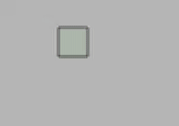

# Документация TUI

The library allows the user to create tile areas on the map. These zones work on the principle of a normal user interface: you can click on this area with The Grand Design and something can happen. For example, you can place a button that, when pressed, will display the specified text in the chat. And in principle, the developer is limited only by his imagination in what can be created on the user interface.
An example would be a minesweeper board game, which took 314 lines of code (including the logic of the game itself):


***

## Contents

* [Interface basics](#Interface-basics)
* [Basic VisualObject operations](#Basic-VisualObject-operations)
* [TUI class](#TUI-class)
* [4 independent ways of automatic regulation of the positions and sizes of objects](#4-independent-ways-of-automatic-regulation-of-the-positions-and-sizes-of-objects)
* [Layout](#Layout)
* [Grid](#Grid)
* [Alignment](#Alignment)
* [FullSize](#FullSize)
* [How touch goes](#How-touch-goes)
* [Class UIConfiguration](#UIConfiguration-class)
* [Class UIStyle](#UIStyle-class)
* [PulseType Signals](#PulseType-signals)
* [Loading and disposing widgets](#Loading-and-disposing-widgets)
* [Database](#Database)
* [Create own widget](#Create-own-widget)
* [General facts about client side of user interface control](#General-facts-about-client-side-of-user-interface-control)
* [Widgets](#Widgets)

***

## Interface basics

Each element, be it a button, a label, an input box, a slider, or something else, is an object, inherited from the
base class VisualObject. For example, slider is a Slider class inherited straight from VisualObject. And button is
a Button class that inherits from the Label class, which, in turn, inherited from VisualObject. Any widget running
in this library must inherit from VisualObject.
Further, these buttons and sliders will be called "widgets".

The whole interface is a set of trees, each vertex of which is a VisualObject or a class object inherited from
VisualObject (widget). So the minesweeper game represents one of these trees. At the same time, the root of the
tree is always an object of the class RootVisualObject or a class inherited from RootVisualObject (for example, Panel).
For developer of application on the interface, the RootVisualObject class object is not much different
from the usual VisualObject, because RootVisualObject is inherited from VisualObject and only adds some
fields and functional (for example, popup window methods ShowPopUp, Alert, Confirm).


The child elements of the VisualObject object are stored in the private field Child (List<VisualObject>).
Usually you do not need to refer to this list directly, but for debugging purposes it is possible: GetChild (int index).
The parent node is stored in the field Parent (VisualObject).
The root of the tree is available by the Root property (RootVisualObject). Note that accessing this field is
possible only after at least one Update of the whole tree is called. To get the root of the tree before calling Update(),
use the GetRoot() method. All interface roots are automatically updated and loaded after game initialization
(on the GamePostInitialize hook), so in your plugin you just need to create your own interface and add it to TUI.

You can add a child in several ways, for example, by calling the Add function:
```cs
VisualObject Add(VisualObject newChild, int? layer);
```

***

## Basic VisualObject operations

There are several important operations that can be applied to VisualObject objects:
1. **Update()**
	* Recursive function that updates each of the objects in the subtree (sets the required values
	to the required fields, calculates the position of the relative elements, ...).
2. **Apply()**
	* Recursive function that draws an object on the map (changing the map tiles according
	to the style of displaying the element).
3. **Draw()**
	* Sending a drawn (though not necessarily) object to players using SendSection or SendTileSquare.
4. **Pulse(PulseType)**
	* Sending the specified signal to the object tree.

The first three operations often go in the indicated order:
```cs
VisualObject node = ...
node.Update().Apply().Draw();
```
Which is logical, because in order to send what is drawn in Draw(), you must first draw it in Apply(),
and in order to draw it in Apply() it is often necessary to first update the widget in Update().

Each one of the methods listed above (with the exception of Draw) work in the following sequence:
1. Apply operation to your object.
2. Apply operation to child objects.
3. Apply other operations to your object.

#### So, Update has the following sequence of updates (occur when you call Update()):
1. Update the fields/properties of your object in UpdateThis().
2. Update the sizes and then the positions of the child objects in UpdateChildPositioning().
3. Recursively run Update() on child objects.
4. Update the fields/properties of its object, depending on the update of child objects in PostUpdateThis().

For example, calling Update () on a VisualContainer widget does something like the following:
It calculates some of its fields (Root, ProviderX, ProviderY, ...), then it calculates the sizes
and positions of the child elements in the layout/grid/alignment and recursively starts the Update() call on the children.

#### Apply() Sequence:
1. Draw (change blocks) of your vertex in ApplyThis().
2. Run recursively Apply() on child objects in ApplyChild().

For example, the Apply() call on the AlertWindow widget sets a wall 165 in the entire area of ​​the object (Sapphire
Gemspark Wall) with paint 27 (gray), then recursively call Apply() on the children.

#### Pulse(PulseType) Sequence:
1. Process the signal at its vertex in PulseThis(PulseType).
2. Recursively transmit a signal to child objects in PulseChild(PulseType).

For example, calling Pulse(PulseType.Reset) on a Slider widget resets the entered value to Input.DefaultValue,
then recursively calls Pulse(PulseType.Reset) on the children.

The Draw call sends a section or SendTileSquare object-sized to all players near the interface.

***

## TUI class

There is a static class TUI, which is a list of roots RootVisualObject
and has operations similar to those described above for a VisualObject:
Update, Apply, Draw
These functions make the same call for all roots. So as to completely update
and draw all the user interface trees, you need to run:
```cs
TUI.Update();
TUI.Apply();
TUI.Draw();
```

To create a new interface, you must call the Create method of the TUI class:
```cs
RootVisualObject Create(RootVisualObject root);
```

This method creates a RootVisualObject object, (which, in turn, is inherited from
VisualObject), then adds it to the TUI root list.
Thus, now the system, when processing clicks, *sees* this object and checks whether the player has pressed it.

All elements of this interface now should be added already to this panel, here is an example of creating
panel and adding multiple widgets to it:
```cs
// Determine the position and size of the interface.
int x = 100, y = 100, w = 50, h = 40;
// Pass an empty provider to the panel (the interface will be drawn on Main.tile).
object provider = null;
// Although we can use as a provider, for example, FakeTileRectangle from FakeManager:
//object provider = FakeManager.FakeManager.Common.Add("TestPanelProvider", x, y, w, h);

// Create a panel with a wall of diamond gemspark wall with black paint.
Panel root = TUI.TUI.Create(new Panel("TestPanel", x, y, w, h, null,
	new ContainerStyle() { Wall = WallID.DiamondGemspark, WallColor = PaintID.Black }, provider)) as Panel;
// Create a Label widget (text display) with white characters.
Label label1 = new Label(1, 1, 17, 2, "some text", new LabelStyle() { TextColor = PaintID.White });
// Add to panel
root.Add(label1);

// Create a container that occupies the lower (larger) half of our panel, painted over with white paint.
// The Add function returns the newly added object in the VisualObject type,
// so adding an element can be implemented as follows:
VisualContainer node = root.Add(
	new VisualContainer(0, 15, w, 25, null, new ContainerStyle() { WallColor = PaintID.White })
) as VisualContainer;
// Add a button to this container, which, when clicked, will send the clicker to the chat.
node.Add(new Button(5, 0, 12, 4, "lol", null, new ButtonStyle()
	{ Wall=165, WallColor = PaintID.DeepGreen }, (self, touch) =>
		touch.Player().SendInfoMessage("You pressed lol button!")));
```


***

## 4 independent ways of automatic regulation of the positions and sizes of objects

#### Positioning child objects within the current object:
* **[Layout](#Layout)**
* **[Grid](#Grid)**

#### Positioning the current object within the parent:
* **[Alignment](#Alignment)**

#### Regulation of the size of the object relative to the parent:
* **[FullSize](#FullSize)**

***

## Layout

The SetupLayout method allows you to automatically have children added using the AddToLayout
method in a specific order one after the other in the specified direction:

```cs
VisualObject SetupLayout(Alignment alignment, Direction direction, Side side, ExternalOffset offset, int childIndent, bool boundsIsOffset);
```
<details><summary> <sup><b><ins>Parameters</ins></b> (click here to expand)</sup> </summary>
<p>

* Alignment **alignment**
	* Side/angle/center where layout objects will be located. For example, the upper right corner is Alignment.TopRight.
* Direction **direction**
	* The direction in which the objects will be added. For example, down - Direction.Down.
* Side **side**
	* The side to which the objects will abut. For example, in the center - Side.Center.
* ExternalOffset **offset**
	* Layout offset. For example, offset from above for 3 and from left for 2: new ExternalOffset () {Up = 3, Left = 2}
* int **childIndent**
	* Distance between objects in layout.
* bool **boundsIsOffset**
	* If set to true, then blocks of objects that go beyond the offset of the layout will not be drawn.

</p>
</details>

Example:
```cs
// Set the layout configuration.
node.SetupLayout(Alignment.Center, Direction.Right, Side.Center, null, 3, false);
// Add the InputLabel widget to the layout that allows you to input text.
node.AddToLayout(new InputLabel(0, 0, new InputLabelStyle()
	{ TextColor = PaintID.Black, Type = InputLabelType.All, TextUnderline = LabelUnderline.None },
	new Input<string>("000", "000")));
// Add to the layout one more ItemRack widget that corresponds to the Weapon rack: displaying an item
// on a 3x3 rack. By clicking displays the relative and absolute coordinates of this click.
node.AddToLayout(new ItemRack(0, 0, new ItemRackStyle() { Type = 200, Left = true }, (self, touch) =>
	Console.WriteLine($"Touch: {touch.X}, {touch.Y}; absolute: {touch.AbsoluteX}, {touch.AbsoluteY}")));
ItemRack irack1 = node.AddToLayout(new ItemRack(0, 0,
	new ItemRackStyle() { Type = 201, Left = true })) as ItemRack;
// ItemRack allows you to add text on top using a sign:
irack1.SetText("lololo\nkekeke");
// Finally, add the slider to the layout.
node.AddToLayout(new Slider(0, 0, 10, 2, new SliderStyle()
	{ Wall = WallID.AmberGemsparkOff, WallColor = PaintID.White }));
```


***

## Grid

The SetupGrid method allows you to represent an object in the form of a grid with absolute or relative sizes of columns and lines:
```cs
VisualObject SetupGrid(IEnumerable<ISize> columns, IEnumerable<ISize> lines, Offset offset, bool fillWithEmptyObjects);
```
<details><summary> <sup><b><ins>Parameters</ins></b> (click here to expand)</sup> </summary>
<p>

* IEnumerable\<ISize\> **columns**
	* The size of the columns. For example, the left column is 10 blocks in size, and the right one is the remaining space: new ISize [] {Absolute (10), Relative (100)}
* IEnumerable\<ISize\> **lines**
	* Sizes of lines. For example, the central line occupies 20 blocks, and the upper and lower equally divide the remaining space: new ISize [] {Relative (50), Absolute (20), Relative (50)}
* Offset **offset**
	* The offset of the grid, including the inner indents of the cells between them and the outer indents from the object boundary.
* bool **fillWithEmptyObjects**
	* Whether all cells should be automatically filled with empty VisualContainer or not.

</p>
</details>

Example:
```cs
// Set up the grid configuration. Specify that it has to fill all the cells automatically.
// Two columns (right size of 15, left - everything else) and two lines, occupying the same amount of space.
node.SetupGrid(
	new ISize[] { new Relative(100), new Absolute(15) }, // Размеры колонок
	new ISize[] { new Relative(50), new Relative(50) }, // Размеры линий
	null, true);
// In the top left cell (at the intersection of the first column and the first line), set the background color to orange.
node[0, 0].Style.WallColor = PaintID.DeepOrange;
// At the top right, we put a sapphire (blue) wall without paint.
node[1, 0].Style.Wall = WallID.SapphireGemspark;
node[1, 0].Style.WallColor = PaintID.None;
// In the bottom left cell, you can place the Label widget with the SandStoneSlab block.
// Although the coordinates and sizes are specified as 0, they will automatically be
// set, since the object is in the Grid.
node[0, 1] = new Label(0, 0, 0, 0, "testing", null, new LabelStyle()
{
	Tile = TileID.SandStoneSlab,
	TileColor = PaintID.Red,
	TextColor = PaintID.Black
});
```


For tests, you can call the ShowGrid() function to see the grid even without objects:
```cs
// Install a large and complex grid.
node.SetupGrid(new ISize[] { new Absolute(3), new Relative(50), new Absolute(6), new Relative(50) },
	new ISize[] { new Relative(20), new Absolute(5), new Relative(80) });
// Although we set the grid on the node, we can still add objects as before.
// Add a button that draws the grid by pressing, and hides it when released.
node.Add(new Button(3, 3, 10, 4, "show", null, new ButtonStyle()
{
	WallColor = PaintID.DeepBlue,
	BlinkStyle = ButtonBlinkStyle.Full,
	TriggerStyle = ButtonTriggerStyle.Both
}, (self, touch) =>
{
	if (touch.State == TouchState.Begin)
		node.ShowGrid();
	else
		node.Apply().Draw();
}));
```


***

## Alignment

The SetAlignmentInParent method allows you to automatically position an object in a relative position inside of the parent:

```cs
VisualObject SetAlignmentInParent(Alignment alignment, ExternalOffset offset, bool boundsIsOffset);
```
<details><summary> <sup><b><ins>Parameters</ins></b> (click here to expand)</sup> </summary>
<p>

* Alignment **alignment**
	* The location of the object inside the parent.
* ExternalOffset **offset**
	* Offset from parental boundaries.
* bool **boundsIsOffset**
	* Whether to draw tiles which get beyond offset.

</p>
</details>

Example (Add method returns newly added child object):
```cs
// Add a label and immediately set Alignment.DownRight with offset 3 blocks to the right and 1 below.
node.Add(new Label(0, 0, 16, 6, "test", new LabelStyle() { WallColor = PaintID.DeepPink }))
	.SetAlignmentInParent(Alignment.DownRight, new ExternalOffset() { Right = 3, Down = 1 });
```


***

## FullSize

The SetFullSize method allows you to automatically set the size of an object (both in width and height)
relative to the size of the parent (expand exactly to the size of the parent object):
```cs
VisualObject SetFullSize(bool horizontal, bool vertical);
```
<details><summary> <sup><b><ins>Parameters</ins></b> (click here to expand)</sup> </summary>
<p>

* bool **horizontal**
	* Set the width of the object to the width of the parent.
* bool **vertical**
	* Set the height of the object to the height of the parent.

</p>
</details>

Или:
```cs
VisualObject SetFullSize(FullSize fullSize);
```
<details><summary> <sup><b><ins>Parameters</ins></b> (click here to expand)</sup> </summary>
<p>

* FullSize **fullSize**
	* One of values: FullSize.None, FullSize.Horizontal, FullSize.Vertical, FullSize.Both.

</p>
</details>

Example:
```cs
// Let's make our node container the size of the root in width.
node.SetFullSize(true, false);
```


***

## How touch goes

Each element of the interface can be clicked on with the subject The Grand Design.
Each click corresponds to an object pressing the Touch, containing all the necessary information about it.

### Touch class
<details><summary> <b><ins>Properties</ins></b> (click here to expand) </summary>
<p>

* int **X**
	* The horizontal coordinate relative to the object's left border.
* int **Y**
	* The vertical coordinate relative to the upper boundary of the object.
* int **AbsoluteX**
	* The horizontal coordinate relative to the left border of the world.
* int **AbsoluteY**
	* The vertical coordinate relative to the top of the world.
* TouchState **State**
	* State of touch. Accepts one of the following values: Begin, Moving, End.
* UserSession **Session**
	* And object of user interface related data.
* VisualObject **Object**
	* The object on which this touch is hit.
* int **Index**
	* Index of touch, counted from the beginning of touch session (TouchState.Begin).
* int **TouchSessionIndex**
	* The index of the touch session in which this touch was made.
* bool **Undo**
	* true for touch with TouchState.End, if the player has finished clicking with the
	right mouse button (canceling action).
* byte **Prefix**
	* The Grand Design prefix.
* bool **Red**, **Green**, **Blue**, **Yellow**, **Actuator**, **Cutter**
	* Is the red/green/yellow wire/actuator/cutter turned on? Only relevant at the time of TouchState.End.
* DateTime **Time**
	* Time of touch in UTC.

</p>
</details>

The interval of clicking is the time from pressing the left mouse button (creating a plan
project file) to releasing the left mouse button or canceling with the right mouse button.

The interval of clicking is the time from pressing the left mouse button (creating projectile)
to releasing the left mouse button or canceling with the right mouse button.
* TouchState.Begin
	* When you click the left mouse button.
* TouchState.Moving
	* When moving The Grand Designed with the mouse button held down.
* TouchState.End
	* When you release the left mouse button or cancel the action with the right mouse button.

Each player corresponds to a UserSession object (player's session) that stores some
general information about him.

### UserSession class
<details><summary> <b><ins>Properties</ins></b> (click here to expand) </summary>
<p>

* bool **Enabled**
	* If set to false, then all touches until the next TouchState.End will be ignored.
	Then the player will be able to press again.
* int **PlayerIndex**
	* The index of the user corresponding to this UserSession object.
* int **TouchSessionIndex**
	* The current index of the touch session. Increases by 1 with each TouchState.End.
* int **ProjectileID**
	* ID of The Grand Design projectile corresponding to this touch.
* Touch **PreviousTouch**
* Touch **BeginTouch**
	* First touch of touch session (TouchState.Begin).
* VisualObject **Acquired**
	* Object attached to the interval of touch. Once you attach a VisualObject to touch session
	using Configuration.SessionAcquire, all subsequent touches will be passed only to this object
	until the touch session is finished (TouchState.End).
* ConcurrentDictionary<object, object> **Data**
	* Private runtime data storage, that you can access with operator this[object key].

</p>
</details>

When clicked, if this object satisfies the conditions (see [UIConfiguration] (# Class-UIConfiguration)),
the VisualObject.Invoke(Touch touch) method is called with the touch information object being passed.
The Invoke method by default calls the callback function stored in the VisualObject.Callback field. This is a user-defined function in which the programmer indicates that he wants to occur by clicking on this object. Widgets written in C # may not use this function, but directly override Invoke.

***

## UIConfiguration class

Each VisualObject has the touch and draw settings stored in the Configuration property of type UIConfiguration.
<details><summary> <b><ins>Properties</ins></b> (click here to expand) </summary>
<p>

* bool **UseBegin**
	* Allows to touch this node if touch.State == TouchState.Begin. True by default.
* bool **UseMoving**
	* Allows to touch this node if touch.State == TouchState.Moving. False by default.
* bool **UseEnd**
	* Allows to touch this node if touch.State == TouchState.End. False by default.
* bool **SessionAcquire**
	* Once node is touched all future touches within the same session will pass to this node.
* bool **BeginRequire**
	* Allows to touch this node only if current session began with touching it.
* bool **UseOutsideTouches**
	* Only for nodes with SessionAcquire. Passes touches even if they are not inside of this object.
* bool **Ordered**
	* Touching child node would place it on top of Child array layer so that it would be drawn
	above other objects with the same layer and check for touching first.
* object **Permission**
	* Object that should be used for checking if user can touch this node (permission string for TShock).
* Lock **Lock**
	* Touching this node would prevent touches on it or on the whole root for some time.
* CustomCallbacks **Custom**
	* Collection of custom callbacks.

</p>
</details>

***

## UIStyle class

Each VisualObject has drawing styles that are stored in the Style property of the UIStyle type.
Each of the UIStyle properties is Nullable, a null value means to leave
this parameter is as-is (using this transparency is implemented).
<details><summary> <b><ins>Properties</ins></b> (click here to expand) </summary>
<p>

* bool? **Active**
	* Sets tile.active(Style.Active) for every tile.
	If not specified sets to true in case Style.Tile is specified,
	otherwise to false in case Style.Wall is specified.
* ushort? **Tile**
	* Sets tile.type = Style.Tile for every tile.
* byte? **TileColor**
	* Sets tile.color(Style.TileColor) for every tile.
* byte? **Wall**
	* Sets tile.wall = Style.Wall for every tile.
* byte? **WallColor**
	* Sets tile.wallColor(Style.WallColor) for every tile.
* bool? **InActive**
	* Sets tile.inActive(Style.InActive) for every tile.

</p>
</details>

***

## PulseType signals

Using Pulse(PulseType), PulseThis(PulseType), and PulseChild(PulseType) functions you can
distribute signals in the tree of interface objects of the following types:
* Reset
	* Signal of object settings/data reset. In data input widgets, sets initial values, etc.
* PositionChanged
	* The signal is sent automatically to the subtree if the root of this subtree (some VisualObject) has changed its position or size.
* User1
	* User defined signal
* User2
* User3

***

## Loading and disposing widgets

Some widgets need to load resources when they are created and free them when they are deleted.
The library has a tool for working with similar resources:
Any widget has overridable methods LoadThisNative() and DisposeThisNative(), which are called
automatically during load and release of resources, respectively. Load() occurs once and automatically
when a widget is added to the main tree of the interface. At the same time it is guaranteed that
the load will occur after the game is initialized (GamePostInitialize event). Dispose() is happens once
and automatically when a TUI plugin disposes and when an object is removed using Remove() (thus,
once-deleted objects cannot be used again). At the same time it is guaranteed that dispose
will not occur if object wasn't loaded.
```cs
virtual void LoadThisNative();
virtual void DisposeThisNative();
```

***

## Database

Each VisualObject has a Name and FullName property.
Name is required when creating RootVisualObject/Panel, for other objects this property is optional.

FullName - full name (path) in interface tree.
For example:
1. Create a Panel called "TestPanel" and add the VisualContainer container to it.
2. Add Slider to this container.
3. The FullName property of this slider will display the value "TestPanel[0].VisualContainer[0].Slider",
where 0 is the index in the array of child elements.
4. On the container, set the Name property to the value "lol".
5. The same FullName slider property will now produce "TestPanel.lol[0].Slider".
6. In the slider, set the Name property to "kek".
7. The FullName slider property will now issue "TestPanel.lol.kek".

The FullName field is the key by which object data is stored in the database in
key-value format table. Therefore, if you want to store at some VisualObject
data in the database, it is recommended that this object and all its parents set the unique Name property,
so that changing the index in the array does not change the key and, accordingly, the data.

You can read data from the database using the DBRead method:
```cs
bool DBRead();
```
You can write data to the database using the DBWrite method:
```cs
void DBWrite();
```
By default these methods attempt to call the Configuration.Custom.DBRead and Configuration.Custom.DBWrite functions, respectively.

Data is written and read in streaming format. To determine read behavior
there are overridable functions for reading/writting to BinaryReader:
```cs
virtual void DBReadNative(BinaryReader br);
virtual void DBWriteNative(BinaryWriter bw);
```

For example, the Panel widget overrides these methods in order to remember the position and dimensions:
```cs
protected override void DBReadNative(BinaryReader br)
{
	int x = br.ReadInt32();
	int y = br.ReadInt32();
	int width = br.ReadInt32();
	int height = br.ReadInt32();
	SetXYWH(x, y, width, height);
}

protected override void DBWriteNative(BinaryWriter bw)
{
	bw.Write((int)X);
	bw.Write((int)Y);
	bw.Write((int)Width);
	bw.Write((int)Height);
}
```

The above is relevant for storing data related to the object as a whole, but not to a specific user.
To store data related to this object and the user in the aggregate there are similar methods with user ID:
```cs
bool UDBRead(int user);
void UDBWrite(int user);
virtual void UDBReadNative(BinaryReader br, int user);
virtual void UDBWriteNative(BinaryWriter bw, int user);
```

***

## Tuipanel command

The plugin adds the command ```/tuipanel <panel name> [<x> <y>] [<width> <height>]```.
As the parameter <panel name> you need to specify the name of the root interface object (RootVisualObject).
The Panel widget is also a root object (since it is inherited from RootVisualObject).
By calling the command ```/tuipanel "your panel"```, you will know the coordinates and dimensions of the panel "your panel".
To change the position, you can write: ```/tuipanel "panel" 150 100``` - then the panel "panel" will move to the coordinates (150, 100).
You can also change the dimensions: ```/tuipanel "panel" 150 100 50 40``` - then the panel will not only move, but also change its size by (50, 40).

***

## Creating own widget

To create your own widget, you need to create a class that inherits from VisualObject (or another widget).
For the widget's own/special update (fields/data/statistics/...) of the widget, you can override the UpdateThisNative method.
The UpdateThis method is called before the UpdateChild call, so if the update requires updated child objects, you can override the PostUpdateThisNative method.
Similarly, you can override ApplyThisNative to add your own widget drawing.

***

## General facts about client side of user interface control

1. Client works so that at first packets of touch movement send very frequently but after a second
	speed decreases and becomes stable.
2. In lighting modes Retro and Trippy drawing of interface is faster and more smooth.
3. Right click while holding with the grand design cancels the touch. This action can be handled
	as a cancellation event.
4. Some tiles crash in some circumstances when sending uses SendTileSquare method (e.g. statue without tiles under it).
You can force send with SendSection method by setting object's ForceSection property.

***

# Widgets

<details><summary> <b><ins>List</ins></b> (click here to expand) </summary>
<p>

* [VisualObject](#VisualObject)
* [VisualContainer](#VisualContainer)
* [RootVisualObject](#RootVisualObject)
* [Panel](#Panel)
* [Label](#Label)
* [Button](#Button)
* [Slider](#Slider)
* [Checkbox](#Checkbox)
* [Separator](#Separator)
* [InputLabel](#InputLabel)
* [ItemRack](#ItemRack)
* [VisualSign](#VisualSign)
* [FormField](#FormField)
* [Image](#Image)
* [Video](#Video)
* [AlertWindow](#AlertWindow)
* [ConfirmWindow](#ConfirmWindow)
* [ScrollBackground](#ScrollBackground)
* [ScrollBar](#ScrollBar)
* [Arrow](#Arrow)

</p>
</details>

Most widgets have style parameter in constructor and it is often not the UIStyle object but class
that inherits from UIStyle. For example, ButtonStyle includes both UIStyle properties and different
styles associated with the blinking buttons: BlinkColor, BlinkDelay, TriggerStyle, BlinkStyle.
If the widget has a style in the constructor with its own type (like ButtonStyle at Button),
then this widget has a field with the name of the corresponding style type.
So, the Button widget has the .ButtonStyle property, which contains the value of this style.
Note that in this case, the .Style property returns the same object, but in the UIStyle type.

***

## VisualObject
[More about fields, properties and methods of VisualObject](ru_VisualObject.md)

Basic object of user interface. Every other widget inherits from this type.
As for most of other widgets parameters configuration, style and callback are not neccessarily.
Structure of VisualObject constructor sets the style of all other widget constructors:
[coordinates] -> [sizes] -> [text (no such parameter in this case)] -> [configuration] -> [style] -> [callback function].
```cs
VisualObject(int x, int y, int width, int height, UIConfiguration configuration,
	UIStyle style, Action<VisualObject, Touch> callback);
```
<details><summary> <sup><b><ins>Parameters</ins></b> (click here to expand)</sup> </summary>
<p>

* int **x**
	* *Relative* horizontal coordinate from left side of Parent (or from left border of world in case there is no Parent object).
* int **y**
	* *Relative* vertical coordinate from top side of Parent (or from top border of world in case there is no Parent object).
* int **width**
	* Object width.
* int **height**
	* Object height.
* [UIConfiguration **configuration**]
	* Object configuration (when can touch, who can touch, ...)
* [UIStyle **style**]
	* Style of drawing (walls, wall paint, tiles, tile paint, ...)
* [Action<VisualObject, Touch> **callback**]
	* Function to be called when someone touches this object. Has 2 parameters:
	VisualObject (this object) and Touch - data about touch coordinates, state, pressing player (.Session.UserIndex), ...
You can get access TSPlayer by calling touch.Player() function that is available in TUIPlugin.dll assembly.

</p>
</details>

Example:
```cs
VisualObject obj = node.Add(new VisualObject(5, 5, 8, 4, null, new UIStyle()
{
	Wall = WallID.AmethystGemspark,
	WallColor = PaintID.DeepPurple
}, (self, touch) =>
	TSPlayer.All.SendInfoMessage($"Relative: ({touch.X}, {touch.Y}); Absolute: ({touch.AbsoluteX}, {touch.AbsoluteY})")));
```


***

## VisualContainer
Container widget for holding other widgets inside. It is highly recommended to use it despite the fact
that you can use a regular VisualObject or any other widget for holiding other objects inside.
VisualContainer guarantees correct work of widgets ScrollBackground and ScrollBar inside this container.
```cs
VisualContainer(int x, int y, int width, int height, UIConfiguration configuration,
	ContainerStyle style, Action<VisualObject, Touch> callback);
VisualContainer();
VisualContainer(UIConfiguration configuration);
VisualContainer(ContainerStyle style);
```
<details><summary> <b><ins>ContainerStyle</ins></b> properties (click here to expand) </summary>
<p>

* All properties of [UIStyle](#UIStyle-class)
* bool Transparent
	* If set to false then container would inherit parent's wall and wall paint,
	also every Apply() would clear every tile before drawing.

</p>
</details>

Example:
```cs
VisualContainer node2 = node.Add(
	new VisualContainer(5, 5, 20, 10, null, new ContainerStyle() { WallColor = PaintID.Black })
) as VisualContainer;
```

***

## RootVisualObject
[More about fields, properties and methods of RootVisualObject](en_VisualObject.md#RootVisualObject--VisualObject)

Widget that must be the root of a user interface tree.
```cs
RootVisualObject(string name, int x, int y, int width, int height,
	UIConfiguration configuration, ContainerStyle style, object provider);
```
<details><summary><sup><b><ins>Parameters</ins></b> (click here to expand)</sup> </summary>
<p>

* string **name**
	* Unique name of user interface root.
* object **provider**
	* Object of tile provider (ITileProvider). By default - null (interface would be drawn on Main.Tile,
	tiles of map would be modified irrevocably).
	You can use FakeTileRectangle from [FakeManager](https://github.com/AnzhelikaO/FakeManager) as a value,
	so that interface would draw *above* the map.

</p>
</details>

***

## Panel
Variety of RootVisualObject that has some features:
Panel can be moved and can change size.
By default the panel has 2 buttons:
* Button for moving panel (drag) 1x1 in top left corner.
* Button for changin panel size (resize) 1x1 in bottom right corner.

Panel saves it's position and size automatically to database and loads it on server start.
You can save the position and size manually by calling SavePosition() method.

```cs
Panel Panel(string name, int x, int y, int width, int height,
	UIConfiguration configuration = null, UIStyle style = null, object provider = null);
Panel Panel(string name, int x, int y, int width, int height, UIConfiguration configuration,
	UIStyle style, PanelDrag drag, PanelResize resize, object provider = null);
```


***

## Label
Widget for showing text with character and digit statues.
```cs
Label(int x, int y, int width, int height, string text, LabelStyle style);
```
<details><summary><b><ins>LabelStyle</ins></b> properties (click here to expand) </summary>
<p>

* All properties of [UIStyle](#UIStyle-class)
* byte **TextColor**
* Offset **TextOffset**
* Alignment **TextAlignment**
	* Where to place the text (up right corner/down side/center/...)
* Side **TextSide**
	* Side to which shorter lines would adjoin.
* LabelUnderline **TextUnderline**
	* Whether to use underline part of statues for characters (makes their size 2x3 instead of 2x2).
* byte **TextUnderlineColor**
	* Color of statue underline part (if TextUnderline is LabelUnderLine.Underline).

</p>
</details>

Example:
```cs
Label label = node.Add(new Label(15, 5, 19, 4, "some text", new LabelStyle()
{
	WallColor = PaintID.DeepLime,
	TextColor = PaintID.DeepRed
})) as Label;
```


***

## Button
Button that invokes specified actions and blinks in specified style.
Inherits from Label.
```cs
Button(int x, int y, int width, int height, string text, UIConfiguration configuration,
	ButtonStyle style, Action<VisualObject, Touch> callback)
```
<details><summary><b><ins>ButtonStyle</ins></b> properties (click here to expand) </summary>
<p>

* All properties of [LabelStyle](#Label)
* ButtonTriggerStyle **TriggerStyle**
	* When to invoke Callback: on TouchState.Begin, on TouchState.End or on both.
* ButtonBlinkStyle **BlinkStyle**
	* Style of blinking. Currently supports: left border blinking, right border blinking, full object blinking.
* byte **BlinkColor**
	* Color of blink if BlinkStyle is not None.
* int **BlinkDelay**
	* Minimal interval of blinking.

</p>
</details>

Example:
```cs
Button button = node.Add(new Button(15, 5, 12, 4, "lol", null, new ButtonStyle()
{
	WallColor = PaintID.DeepGreen,
	BlinkColor = PaintID.Shadow,
	TriggerStyle = ButtonTriggerStyle.TouchEnd
}, (self, touch) => touch.Player().SendInfoMessage("You released lol button!"))) as Button;
```


***

## Slider
Slider for specifying a number from [0; width - 1] range value.
```cs
Slider(int x, int y, int width, int height, SliderStyle style, Input<int> input);
```
* [input] - every input widget has such parameter in constructor.
	It contains Value of type <T>, DefaultValue and Action<VisualObject, T> Callback function (that is called when value changes) fields.
<details><summary><b><ins>SliderStyle</ins></b> properties (click here to expand) </summary>
<p>

* All properties of [UIStyle](#UIStyle-class)
* bool **TriggerInRuntime**
	* Whether to invoke input callback on TouchState.Moving touches.
* byte **UsedColor**
	* Color of left part that corresponds to *used* part of value.
* byte **SeparatorColor**
	* Color of small separator between *used* part and *unused* one.

</p>
</details>

Example:
```cs
Slider slider = node.Add(new Slider(15, 5, 10, 2, new SliderStyle()
{
	Wall = WallID.EmeraldGemspark,
	WallColor = PaintID.White,
	SeparatorColor = PaintID.Black,
	UsedColor = PaintID.DeepOrange
}, new Input<int>(0, 0, (self, value, playerIndex) =>
	TShock.Players[playerIndex].SendInfoMessage("Slider value: " + value)))) as Slider;
```


***

## Checkbox
Button 2x2 with 2 states: on and off.
```cs
Checkbox(int x, int y, int size, CheckboxStyle style, Input<bool> input = null);
```
<details><summary><b><ins>CheckboxStyle</ins></b> properties (click here to expand) </summary>
<p>

* All properties of [UIStyle](#UIStyle-class)
* byte **CheckedColor**
	* Color of pressed checkbox.

</p>
</details>

Example:
```cs
Checkbox checkbox = node.Add(new Checkbox(15, 5, 2, new CheckboxStyle()
{
	Wall = WallID.EmeraldGemspark,
	WallColor = PaintID.White,
	CheckedColor = PaintID.DeepRed
}, new Input<bool>(false, false, (self, value, playerIndex) =>
	TSPlayer.All.SendInfoMessage("Checkbox value: " + value)))) as Checkbox;
```


***

## Separator
Empty object for wasting space purposes (for example for adding a space in layout).
```cs
Separator(int size, UIStyle style);
Separator(int width, int height, UIStyle style);
```
Example:
```cs
Separator separator = node.Add(new Separator(6, new UIStyle()
{
	Wall = 156,
	WallColor = PaintID.DeepRed
})) as Separator;
```

***

## InputLabel
Widget for text/digit input. Input takes place character by character by holding left mouce button
and dragging the mouce up/down. Supports a few character alphabets.
Inherits from Label.
```cs
InputLabel(int x, int y, InputLabelStyle style, Input<string> input);
```
<details><summary><b><ins>InputLabelStyle</ins></b> properties (click here to expand) </summary>
<p>

* All properties of [LabelStyle](#Label)
* bool TriggerInRuntime
	* Whether to invoke input callback on TouchState.Moving touches.
* InputLabelType Type
	* Determines which set of characters to use.

</p>
</details>

Example:
```cs
InputLabel input = node.Add(new InputLabel(15, 5, new InputLabelStyle()
{
	Type = InputLabelType.All,
	TextUnderline = LabelUnderline.Underline,
	TextColor = PaintID.DeepRed,
	TextUnderlineColor = PaintID.Black // Этот параметр из LabelStyle
}, new Input<string>("12345", "12345", (self, value, playerIndex) =>
	TSPlayer.All.SendInfoMessage("InputLabel value: " + value)))) as InputLabel;
```


***

## ItemRack
Widget for showing an item using Weapon rack. Top tiles line can be a sign with text.
```cs
ItemRack(int x, int y, ItemRackStyle style, Action<VisualObject, Touch> callback);
```
<details><summary><b><ins>ItemRackStyle</ins></b> properties (click here to expand) </summary>
<p>

* All properties of [UIStyle](#UIStyle-class)
* short **Type**
	* Item NetID.
* bool **Left**
	* Side of weapon rack.
* ItemSize **Size**
	* Size of item (prefix).

</p>
</details>

Example:
```cs
ItemRack irack = node.Add(new ItemRack(15, 5, new ItemRackStyle()
{
	Type = ItemID.LargeDiamond,
	Size = ItemSize.Biggest,
	Left = true
})) as ItemRack;
ItemRack irack2 = node.Add(new ItemRack(20, 5, new ItemRackStyle()
{
	Type = ItemID.SnowmanCannon,
	Size = ItemSize.Smallest,
	Left = true
})) as ItemRack;
irack2.SetText("This is a snowman cannon.");
```


***

## VisualSign
Widget for showing sign with text.
```cs
VisualSign(int x, int y, int width, int height, string text, UIConfiguration configuration,
	UIStyle style, Action<VisualObject, Touch> callback);
```
Example:
```cs
VisualSign vsign = node.Add(new VisualSign(15, 5, "lmfao\nwtf")) as VisualSign;
```

***

## FormField
This widget is needed for adding text to the left of some other widget (e.g. Checkbox, Button, InputLabel, Slider, ...).
Inherits from Label.
```cs
FormField(IInput input, int x, int y, int width, int height, string text,
	LabelStyle style, ExternalOffset inputOffset);
```
<details><summary> <sup><b><ins>Parameters</ins></b> (click here to expand)</sup> </summary>
<p>

* ExternalOffset inputOffset
	* Alignment offset of input (input will automatically gain Alignment.Right).

</p>
</details>

Example:
```cs
FormField ffield = node.Add(new FormField(
	new Checkbox(0, 0, 2, new CheckboxStyle()
	{
		Wall = WallID.AmberGemspark,
		WallColor = PaintID.White,
		CheckedColor = PaintID.DeepRed
	}), 15, 5, 20, 2, "check me", new LabelStyle()
{
	TextColor = PaintID.Shadow,
	TextAlignment = Alignment.Left
}, new ExternalOffset() { Right = 1 })) as FormField;
```


***

## Image
Widget for showing image in extensions: WorldEdit (.dat) or TEdit (.TEditSch).
Loads image by specified Path property. Supports showing signs.
Shows broken image icon in case of unsuccessful load.
You can add own image extension reader by adding an Action to ImageData.Readers by your ".ext" key.
```cs
Image(int x, int y, string path, UIConfiguration configuration, UIStyle style,
	Action<VisualObject, Touch> callback);
Image(int x, int y, ImageData data, UIConfiguration configuration, UIStyle style,
	Action<VisualObject, Touch> callback);
```
Example:
```cs
Image image = node.Add(new Image(15, 5, "Media\\Image.TEditSch")) as Image;
```


***

## Video
Widget for showing a video that consists from Images.
Loads images placed in directory specified by Path property in alphabetic order.
Shows broken image icon in case of unsuccessful load.
```cs
Video(int x, int y, UIConfiguration configuration, UIStyle style, Action<VisualObject, Touch> callback);
```
Example:
```cs
Video video = node.Add(new Video(15, 5, null, new VideoStyle()
{
	Path = "Media\\Animation-1",
	Delay = 100,
	TileColor = PaintID.DeepTeal
}, (self, touch) => (self as Video).ToggleStart())) as Video;
```


***

## AlertWindow
Popup widget with information text and "ok" button.
Can be created by Alert() method of RootVisualObject:
```cs
RootVisualObject Alert(string text, UIStyle style, ButtonStyle okButtonStyle);
```
Example:
```cs
Button alertButton = node.Add(new Button(15, 10, 16, 4, "alert", null, new ButtonStyle()
{
	Wall = WallID.AmberGemspark,
	WallColor = PaintID.DeepOrange
}, (self, touch) => node.Root.Alert("Hello world"))) as Button;
```


***

## ConfirmWindow
Popup widget for action confirmation with information text and "yes" and "no" buttons.
Touching outside the widget is equal to touching 'no' button.
Can be created by Confirm() method of RootVisualObject:
```cs
RootVisualObject Confirm(string text, Action<bool> callback, ContainerStyle style,
	ButtonStyle yesButtonStyle, ButtonStyle noButtonStyle);
```
Example:
```cs
Button confirmButton = node.AddToLayout(new Button(15, 13, 20, 4, "confirm\npls", null, new ButtonStyle()
{
	Wall = WallID.AmberGemspark,
	WallColor = PaintID.DeepTeal
}, (self, touch) => node.Root.Confirm("Very nice", value => TSPlayer.All.SendInfoMessage("Confirmed? " + value)))) as Button;
```


***

## ScrollBackground
Widget for scrolling Parent's layout as on touch screen:
The layout will move when you pull by background.
Widget is always behind all other child objects, that's why you have to press to empty space
to touch it and scroll layer (empty space = where there are no other child objects).
```cs
ScrollBackground(bool allowToPull, bool rememberTouchPosition, bool useMoving,
	Action<ScrollBackground, int> callback);
```
<details><summary> <sup><b><ins>Parameters</ins></b> (click here to expand)</sup> </summary>
<p>

* bool **allowToPull**
	* Ability to pull beyond a border.
* bool **rememberTouchPosition**
	* Pulling the same point of layout background during touch session.

</p>
</details>

Example:
```cs
// <Adding a lot of widgets to layout>
// Specifying layer value as Int32.MinValue so that this widget would be under all other child objects,
// although ScrollBackground specifies this layer by default in custructor so we don't have to do it manually.
ScrollBackground scrollbg = node.Add(new ScrollBackground(true, true, true), Int32.MinValue) as ScrollBackground;
```


***

## ScrollBar
Sidebar for scrolling layout. Adds to one of sides (left/up/right/down).
Doesn't support relative scrolling currently (when layout is too big).
```cs
ScrollBar(Direction side, int width, ScrollBarStyle style);
```
<details><summary><b><ins>ScrollBarStyle</ins></b> properties (click here to expand) </summary>
<p>

* All properties of [UIStyle](#UIStyle-class)
* byte **SliderColor**

</p>
</details>

Example:
```cs
ScrollBar scrollbar = node.Add(new ScrollBar(Direction.Right)) as ScrollBar;
```


***

## Arrow
Simple widget for drawing an arrow 2x2.
```cs
Arrow(int x, int y, ArrowStyle style, Action<VisualObject, Touch> callback);
```
<details><summary><b><ins>ArrowStyle</ins></b> properties (click here to expand) </summary>
<p>

* All properties of [UIStyle](#UIStyle-class)
* Direction **Direction**

</p>
</details>

Example:
```cs
Arrow arrow = node.Add(new Arrow(15, 5, new ArrowStyle()
{
	TileColor = PaintID.DeepBlue,
	Direction = Direction.Left
})) as Arrow;
```
