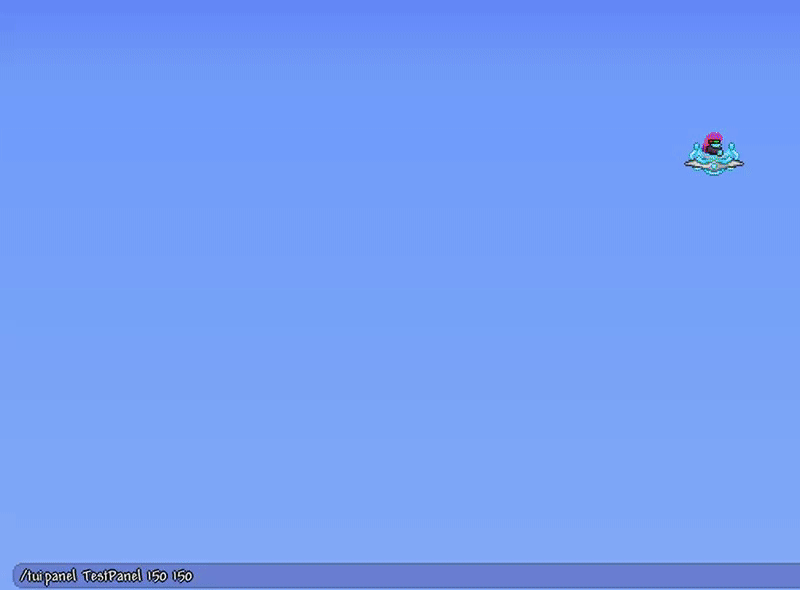

# Terraria User Interface (TUI)
Ingame user interface library for Terraria by [ASgo](https://github.com/ASgoPew) and [Anzhelika](https://github.com/AnzhelikaO).
* You can find english documentation [here](Documentation/en.md).

Библиотека пользовательского интерфейса для Terraria от разработчиков [ASgo](https://github.com/ASgoPew) и [Anzhelika](https://github.com/AnzhelikaO).
* Вы можете найти документацию на русском [здесь](Documentation/ru.md).

***


***

## Installing
This plugin is for TShock version 4.3.26.
To install the plugin you need to do this:
* Add TUI.dll from archive to server root directory (near TerrariaServer.exe).
* Add ServerPlugins/TUIPlugin.dll from archive to ServerPlugins directory.

## Установка
Этот плагин использует TShock версии 4.3.26.
Для установки плагина необходимо:
* Добавить TUI.dll из архива в корневую папку сервера (рядом с TerrariaServer.exe).
* Добавить ServerPlugins/TUIPlugin.dll из архива в папку сервера ServerPlugins.

***

## Example
There is an [example](TUIExample/TUIExamplePlugin.cs) of plugin usage.
You can also find this example plugin in archive and play with it.
By default example will spawn interface at (0, 0) coordinates, so to move it to the place you want you have to use command:
* ```/tuipanel TestPanel <x> <y>```

Be aware that interface will modify your map tiles irreversible if you don't use [FakeManager](https://github.com/AnzhelikaO/FakeManager) as provider.
Use The Grand Design to interact with interface.

## Пример
В этом репозитории есть [пример](TUIExample/TUIExamplePlugin.cs) использования плагина.
Также вы можете найти этот плагин в архиве и попробовать его.
По умолчанию пример создает интерфейс на позиции (0, 0), так что, чтобы поместить его туда, куда вам надо, вам надо использовать команду:
* ```/tuipanel TestPanel <x> <y>```

Учтите, что интерфейс безвозвратно поменяет блоки, если вы не используете [FakeManager](https://github.com/AnzhelikaO/FakeManager) в качестве провайдера.
Используйте предмет Великий План (The Grand Design), чтобы взаимодействовать с интерфейсом.

