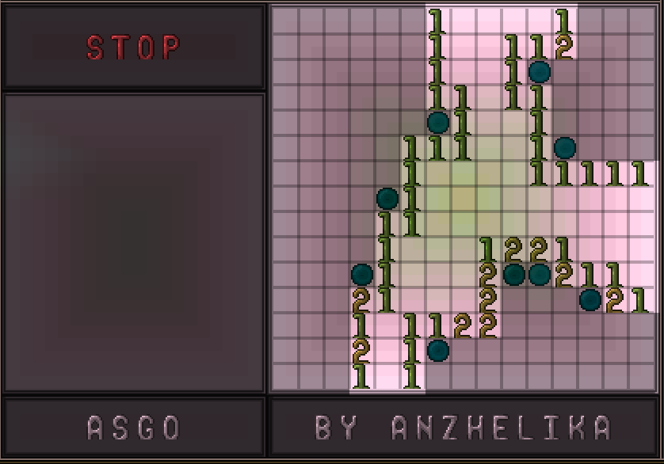
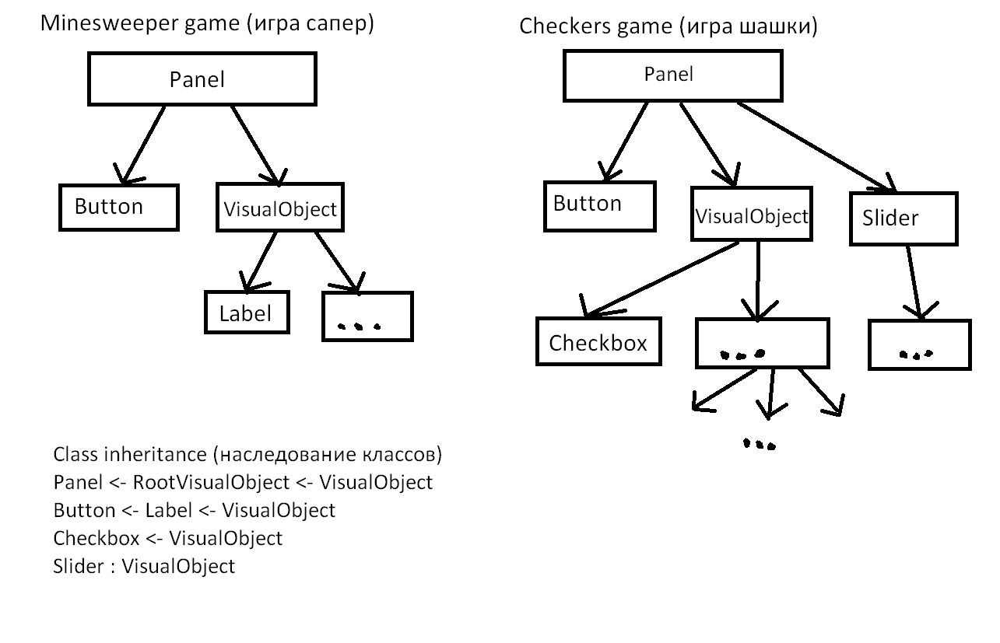

# Документация TUI

Библиотека предоставляет возможность пользователю возможность создавать области блоков на карте,
которые работают по принципу обычного пользовательского интерфейса: на эту область можно нажимать
с помощью the grand design (великий план) и что-то может происходить. Например, можно поставить
кнопку, которая по нажатию будет выводить в чат что-то. И в принципе разработчик ограничен лишь своей
фантазией в том, что можно создать на пользовательском интерфейсе. Примером может быть настольная
игра сапер, на которую ушло 314 строк кода (включая логику самой игры):



Эти и некоторые другие примеры игр вы можете посмотреть в измерении games на сервере terraria-servers.ru:7777.

## Основы интерфейса

Каждый элемент, будь то кнопка, надпись, поле ввода, слайдер или что-то еще, является объектом класса,
наследуемого от базового класса VisualObject. Например, слайдер - это класс Slider, наследующийся сразу
от VisualObject. А кнопка - это класс Button, наследующийся от класса Label, который тоже в свою очередь
наследуется от VisualObject. Любой виджет, работающий в этой библиотеке обязан наследоваться от VisualObject.
Весь интерфейс сам по себе представляет из себя набор деревьев, каждая вершина которого - VisualObject
или объект класса, наследующегося от VisualObject. Таким образом, игра сапер представляет из себя одно из
таких деревьев. При этом корень дерева - это всегда объект класса RootVisualObject или класса,
наследующегося от RootVisualObject (например Panel). Для разработчика приложений на интерфейсе объект
класса RootVisualObject не особо отличается от обычного VisualObject, потому как RootVisualObject наследуется
от VisualObject и лишь добавляет некоторые поля и функционал (например, функция всплывающего окна).



Дочерние элементы объекта VisualObject находятся в поле закрытом поле Child (List<VisualObject>).
Обычно не требуется обращение к этому списку напрямую, но в целях отладки это возможно: GetChild(int index)
Родительсткая вершина хранится в поле Parent (VisualObject).
Корень дерева доступен по геттеру Root (RootVisualObject). Учтите, что получить доступ к этому полю
можно только после того, как будет вызван Update всего дерева. Чтобы получить корень дерева
до вызова Update(), воспользуйтесь методом GetRoot().
Добавить дочерний элемент можно несколькими способами, например - вызвав функцию Add:

```VisualObject *Add*(VisualObject newChild)```

## Базовые операции над VisualObject

Есть несколько важных операций, которые можно применять к объектам VisualObject:
1. **Update()**
Рекурсивная функция, обновляющая каждый из объектов поддерева (устанавливает нужные значения в
нужные поля, рассчитывает позицию относительных элементов, ...)
2. **Apply()**
Рекурсивная функция, отрисовывающая объект на карте (изменение блоков карты в соостветствии
со стилем отображения элемента)
3. **Draw()**
Отправка отрисованного (хотя не обязательно) объекта игрокам с помощью SendSection или SendTileSquare

Эти три операции обычно идут в указанном порядке и делают примерно следующее:
Вызов Update вычисляет некторые свои поля (Root, ProviderX, ProviderY, ...), потом вычисляет позиции
дочерних элементов и запускает рекурсивно вызов Update у дочерних элементов.
Вызов Apply, например, устанавливает во всей области объекта 155 стену (diamond gemspark wall),
затем рекурсивно вызывает Apply у дочерних элементов.
Вызов Draw отправляет секцию или SendTileSquare всем игрокам.

## Класс TUI

Существует статичный класс TUI, который представляет из себя список корней RootVisualObject
и обладает операциями, похожими на описанные выше для VisualObject:
Update, Apply, Draw
Эти функции делают одноименный вызов для всех корней. Таким образом, чтобы полностью обновить
и отрисовать все деревья пользовательского интерфейса, необходимо выполнить:
UI.Update();
UI.Apply();
UI.Draw();

Чтобы создать новый интерфейс, необходимо вызвать один из методов класса UI:
1. ```RootVisualObject **CreateRoot**(string *name*, int *x*, int *y*, int *width*, int *height*, UIConfiguration *configuration* = null, UIStyle *style* = null, object *provider* = null)```
2. ```Panel **CreatePanel**(string *name*, int *x*, int *y*, int *width*, int *height*, PanelDrag *drag*, PanelResize *resize*, UIConfiguration *configuration* = null, UIStyle *style* = null, object *provider* = null)```
3. ```Panel **CreatePanel**(string *name*, int *x*, int *y*, int *width*, int *height*, UIConfiguration *configuration* = null, UIStyle *style* = null, object *provider* = null)```

Обычно вам нужен последний. Этот метод CreatePanel создает объект Panel, наследующийся от RootVisualObject
(а RootVisualObject, в свою очередь, наследуется от VisualObject), затем добавляет его в список корней TUI.
Таким образом, система теперь при обработке нажатий *увидит* этот объект и проверит, не на него ли нажал игрок.
Все элементы этого интерфейса необходимо теперь добавлять уже к этой панели, вот пример создания
панели и добавления нескольких виджетов на нее:
```cs
// Создаем панель
Panel root = TUI.TUI.CreatePanel("TestPanel", 100, 100, 50, 40, null,
	new ContainerStyle() { Wall = WallID.DiamondGemspark });
// Создаем виджет Label (отображение текста) и добавляем к нашей панели
// Функция Add возвращает только что добавленный объект в типе VisualObject, так что приводим к Label
Label label = root.Add(new Label(1, 1, 17, 2, "some text")) as Label;

// Создаем контейнер, занимающий правую половину нашей панели, закрашенный черной краской
VisualContainer node = root.Add(new VisualContainer(25, 0, 25, 40, null,
  new ContainerStyle() { WallColor = PaintID.Black })) as VisualContainer;
// В этот контейнер добавим кнопку, которая по нажатию будет отправлять нажавшему текст в чат.
Button button = node.Add(new Button(0, 7, 12, 4, "lol", null, new ButtonStyle()
	{ WallColor = PaintID.DeepGreen }, (self, touch) =>
		touch.Player().SendInfoMessage("You pressed lol button!"))) as Button;
```


# 4 независимых способа автоматического регулирования позиций и/или размеров объектов

Позиционирование дочерних объектов внутри текущей вершины:
1. **Layout** (разметка)
2. **Grid** (решетка)

Позиционирование текущей вершины внутри родительской:
1. **Alignment** (отступ)

Регулирование размеров объекта относительно родителя:
1. **FullSize** (полноразмерность)


## Layout

Этот метод позвоялет автоатически распологать детей, добавленных с помощью метода AddToLayout,
в определенном порядке друг за другом в указанном направлении:

```VisualObject SetupLayout(Alignment alignment, Direction direction, Side side, ExternalOffset offset, int childIndent, bool boundsIsOffset)```
* alignment - сторона/угол/центр, где будут распологаться объекты layout. Например, правый верхний угол - Alignment.TopRight
* direction - направление, по которому будут добавляться объекты. Например, вниз - Direction.Down
* side - сторона, к которой будут прилегать объекты. Например, по центру - Side.Center
* offset - отступ layout. Например, отступ сверху на 3 и слева на 2: new ExternalOffset() { Up=3, Left=2 }
* childIndent - расстояние между объектами в layout.
* boundsIsOffset - если установлено true, то блоки объектов, выходящие за границы layout, не будут рисоваться

Пример:
```cs
// Настраиваем конфигурацию layout
node.SetupLayout(Alignment.Center, Direction.Down, Side.Center, new ExternalOffset()
	{ Left = 5, Up = 5, Right = 5, Down = 5 }, 3, false);
// Добавляем в layout виджет InputLabel, позволяющий вводить текст
node.AddToLayout(new InputLabel(0, 0, new InputLabelStyle() { Default = "12345",
	TextColor =PaintID.White, Type = InputLabelType.All, TextUnderline = LabelUnderline.None }));
// Добавляем в layout еще один виджет ItemRack, который соответствует Weapon rack: отображение предмета
// на стойке размером 3х3. По нажатию выводит относительные и абсолютные координаты этого нажатия.
node.AddToLayout(new ItemRack(0, 0, new ItemRackStyle() { Type = 200, Left = true }, (self, touch) =>
	Console.WriteLine($"Touch: {touch.X}, {touch.Y}; absolute: {touch.AbsoluteX}, {touch.AbsoluteY}")));
ItemRack irack = node.AddToLayout(new ItemRack(0, 0,
	new ItemRackStyle() { Type = 201, Left = true })) as ItemRack;
// ItemRack позволяет сверху добавть текст с помощью таблички:
irack.Set("lololo\nkekeke");
// Наконец, добавляем слайдер в layout
node.AddToLayout(new Slider(0, 0, 10, 2, new SliderStyle() { Default = 3,
	Wall = WallID.AmberGemsparkOff, WallColor = PaintID.White }));
```


## Grid

Этот метод позволяет представить объект в виде решетки с абсолютными или относительными размерами колонок и линий:

```VisualObject SetupGrid(IEnumerable<ISize> columns, IEnumerable<ISize> lines, Offset offset, bool fillWithEmptyObjects)```
* columns - размеры колонок. Например, левая колонка размером 10 блоков, а правая - все оставшееся место: new ISize[] { Absolute(10), Relative(100) }
* lines - размеры линий. Например, центральная линия занимает 20 блоков, а верхняя и нижняя поровну делят оставшееся место: new ISize[] { Relative(50), Absolute(20), Relative(50) }
* offset - отступ сетки, включая внутренние отступы ячеек между собой и внешние отступы от границы объекта.
* fillWithEmptyObjects - заполнить ли автоматически все ячейки пустыми VisualContainer или нет.

Пример:
```cs
// Настраиваем конфигуарцию сетки grid. Указываем, что нужно все ячейки заполнить автоматически.
// Одна колонка размером с все доступное место и две линии: нижняя размером 16, остальное - верхняя.
node.SetupGrid(new ISize[] { new Relative(100) }, new ISize[] { new Relative(100), new Absolute(16) }, null, true);
// В первой ячейке (на пересечении первой колонки и первой линии) установим черный цвет фона
node[0, 0].Style.WallColor = PaintID.Black;
// А ячейке второй линии первой колонки назначим новый объект с белым цветом фона
node[0, 1] = new VisualContainer(new ContainerStyle() { WallColor = PaintID.White });
// Заметьте, что кнопка button не будет видна, потому что ее заслоняет объект первой линии сетки
```


Для тестов вы можете установить TUI.ShowGrid в значение true, чтобы видеть решетку даже без объектов:
```cs
TUI.ShowGrid = true;
node.SetupGrid([Absolute(10), Relative(50), Absolute(16), Relative(50)],
	[Relative(20), Absolute(5), Relative(80)]);
```


## Alignment

Этот метод позволяет автоматически распологать объект в относительной позиции в родителе:

```VisualObject SetAlignmentInParent(Alignment alignment, ExternalOffset offset, bool boundsIsOffset)```
* alignment - место расположения объекта в родителе.
* offset - отступы от границ родителя.
* boundsIsOffset - рисовать ли тайлы, которые вылезают за границы offset.

Пример (метод Add возвращает только что добавленный дочерний объект):
```cs
// Добавляем label и сразу устанавливаем Alignment с отступом 1 слева и снизу
node.Add(new Label(0, 0, 10, 4, "test"))
	.SetAlignmentInParent(Alignment.DownLeft, new ExternalOffset(Left=1, Down=1));
```


## FullSize

Этот метод позволяет автоматически устанавливать размеры объекта (как по ширине, так и по высоте)
относительно размеров родителя, а именно - расширять в точности до размеров родителя:

```VisualObject SetFullSize(bool horizontal, bool vertical)```
* horizontal - устанавливать ширину объекта равной ширине родителя.
* vertical - устанавливать высоту объекта равной высоте родителя.

или
```VisualObject SetFullSize(FullSize fullSize)```
* fullSize - одно из значений: FullSize.None, FullSize.Horizontal, FullSize.Vertical, FullSize.Both.

Пример:
```cs
// Добавляем желтый контейнер, устанавливаем его ширину на 3, а по высоте делаем FullSize,
// затем указываем, что он должен быть в правом углу родителя.
// Таким образом у нас получается желтая полоса справа с высотой node и шириной 3.
node.Add(new VisualContainer(new ContainerStyle() { WallColor = PaintID.DeepYellow }))
	.SetWH(3, 0).SetFullSize(false, true).SetAlignmentInParent(Alignment.Right);
```


# Виджеты

## Label
Виджет отображения текста с помощью статуй символов и цифр.
```Label(int x, int y, int width, int height, string text, LabelStyle style)```
Пример использования:
```cs
Label label = node.Add(new Label(1, 1, 15, 2, "some text", new LabelStyle() { TextColor=13 })) as Label;
```

## Button
## Slider
## Checkbox
## Switch
## Separator
## InputLabel
## ItemRack
## Image
## Video
## ScrollBar
## ScrollBackground

Некоторые тайлы ломаются при определенных условиях при отправке с помощью SendTileSquare (например, это статуя без блоков под ней).
Для того, чтобы заставить объект рисоваться с помощью отправок секций, достаточно установить у него поле ForceSection в значение true.


## Общие факты о клиентской стороне управления интерфейсом:
1. Клиент работает так, что в начале нажатия планом пакеты перемещения мыши отправляются очень быстро,
	а начиная с момента примерно через секунду - скорость уменьшается и становится постоянной.
2. В режимах освещения retro и trippy отрисовка интерфейса происходит быстрее и плавнее.
3. Нажатием правой кнопки мыши во время использования плана можно отменить нажатие. Это действие особым
	образом обрабатывается в некоторых виджетах (трактуется как отмена действия)